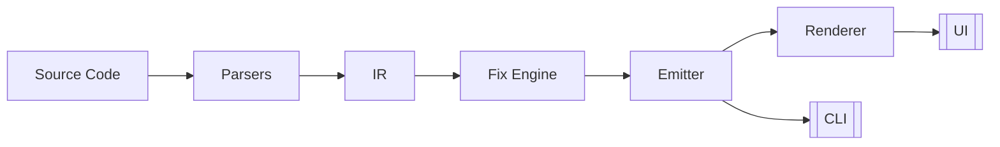
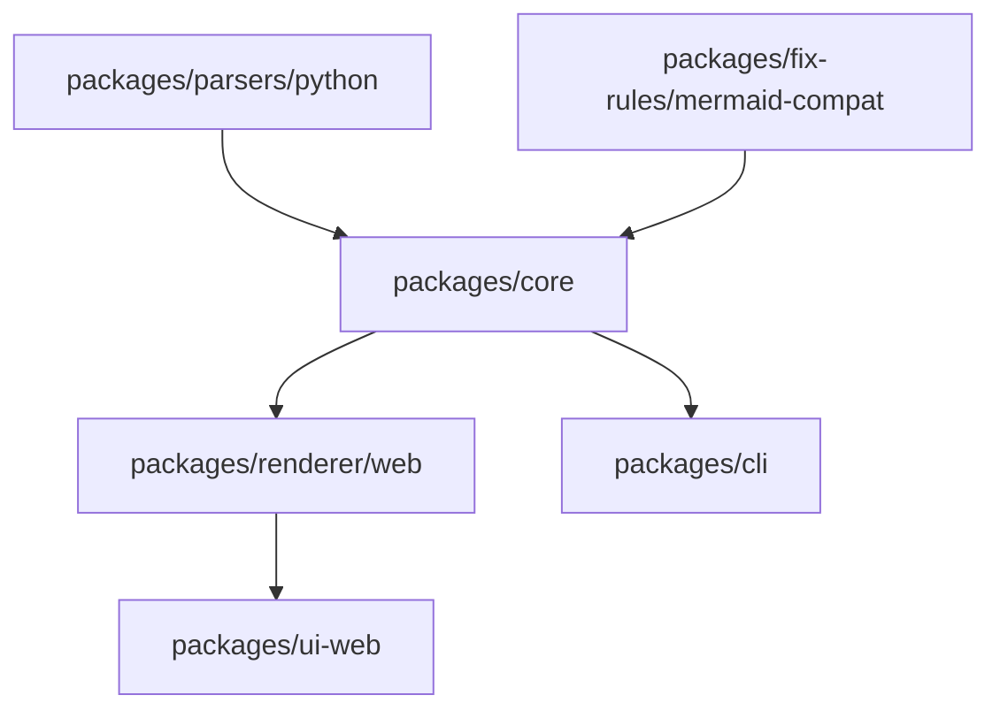

# Architecture Diagrams

完整架構與決策請參考 [DiagramMender‑X Blueprint v1.2](../DiagramMender-X_Blueprint_v1.2_2025-09-13.md).

## Pipeline Overview

```mermaid
flowchart LR
  A[Source Code] --> B[Parsers]
  B --> C[IR]
  C --> D[Fix Engine]
  D --> E[Emitter]
  E --> F[Renderer]
  F --> G[[UI]]
  E --> H[[CLI]]
```

## Package Interaction

```mermaid
graph TD
  CORE[packages/core]
  PYPARSER[packages/parsers/python]
  FIXRULES[packages/fix-rules/mermaid-compat]
  RENDERWEB[packages/renderer/web]
  UIWEB[packages/ui-web]
  CLICMD[packages/cli]

  PYPARSER --> CORE
  FIXRULES --> CORE
  CORE --> RENDERWEB
  CORE --> CLICMD
  RENDERWEB --> UIWEB
```
