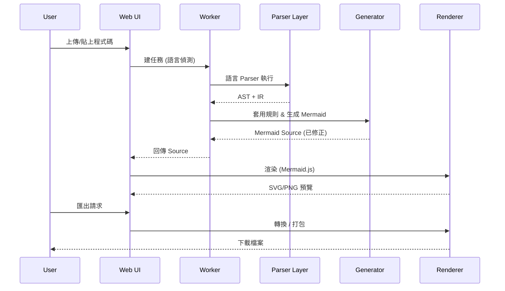

# FEATURES & ROADMAP (v3.7+)

> 本文件詳細拆解使用者提出的五大需求，並對應現況、技術策略、里程碑與風險控管。

## 需求總覽
| # | 使用者需求 | 說明 | 現況 | 下一步 |
|---|------------|------|------|--------|
| 1 | 分析不同程式語言 | 支援多主流語言 (Python / JS / TS / Java / Go / C# ...) | 只針對 Python（部分類別/函式抽取） | 引入 Tree-sitter 多 grammar，以 plugin 形式載入 |
| 2 | 分析並理解程式架構 | 產生類別、模組、依賴、呼叫關係圖 | Class 基礎 | 建 IR + 呼叫圖 / 依賴圖生成器 |
| 3 | 產出 & 修正 Mermaid | 自動補宣告、統一語法、升級過時寫法 | Flowchart/Class 初步 autofix | Lint RulePack + 格式化器 + Diff 比較 |
| 4 | 排列組合 + 圖片渲染 | UI 自訂視圖、輸出 SVG/PNG | 基礎渲染 + PNG/SVG | 多視圖切換 + PDF + ZIP 批次 |
| 5 | 全程商用 UI | 專案管理、版本追蹤、權限 | 單頁工具 Demo | Workspace + RBAC + 差異分析 + SaaS API |

---

## 技術藍圖

### 1. 多語言解析層 (Language Layer)
- Tree-sitter grammar 動態載入 (以 JSON manifest 註冊)
- Parser Adapter 介面：
```ts
interface ParsedEntity {
  kind: 'class' | 'function' | 'module' | 'interface' | 'enum' | 'call';
  name: string;
  location?: { file: string; line: number };
  relations?: Relation[]; // e.g. inheritance, call, dependency
}
```
- 緩存策略：同一檔案 hash → AST cache → IR
- Fallback：無對應 grammar 時，僅做簡單關鍵字掃描 (降級標記)

### 2. IR (Intermediate Representation)
- 標準化欄位：`entities[]`, `relations[]`, `namespaces[]`
- Relation 類型：`EXTENDS`, `IMPLEMENTS`, `CALLS`, `DEPENDS_ON`, `IMPORTS`
- IR Validation：Schema + 冪等測試 (再生成同一 IR 不應差異)

### 3. Mermaid 生成與修復
- Diagram 目標：`classDiagram`, `flowchart`, `sequenceDiagram`, `erDiagram`, (未來) `timeline`/`stateDiagram`
- Autofix 規則分類：
  - `structure`: 補標頭、方向、節點宣告
  - `syntax`: graph → flowchart 升級、移除尾端分號
  - `naming`: 節點標籤正規化 (空白/特殊字元)
  - `layout`: 排序 (拓樸 / 字母序 / 分群)
- 格式化策略：
  - 針對 flowchart：同層縮排、統一箭頭 `-->`
  - classDiagram：類別區塊排序：屬性 → 方法 → 關係

### 4. 視覺化與互動
- 互動層：
  - 篩選 (Filter by namespace / pattern)
  - 折疊 (Collapse 子命名空間)
  - 視圖模式切換 (Class / Dependency / Call / Sequence)
- 匯出：
  - Pipeline：`Mermaid Source` → `Render (SVG)` → `Canvas (Rasterize)` → `toBlob` → Download
  - 批次匯出：多圖 Zip 打包 (附 metadata.json)

### 5. 商用 / 企業功能 (Enterprise Layer)
- 使用者 / 角色：Viewer / Editor / Admin
- 專案工作區：儲存多套 IR 與生成設定 (Layout Profile)
- 差異分析：兩個 IR JSON → Relation 差集 → 標記新增/移除/變更
- API：`POST /analyze`、`POST /diff`、`POST /render` (支援 IR 或原始碼上傳)
- 審計 Trail：操作紀錄、匯出紀錄

---

## 流程示意 (解析到匯出)


---

## 里程碑 (Milestones)
| 階段 | 目標 | 交付物 |
|------|------|--------|
| M1 | 多語言最小可行 | JS/TS Grammar + 基礎 IR + Flowchart/Class 生成 |
| M2 | 修復與格式化升級 | Lint/Autofix RulePack v1 + 格式化器 + CLI |
| M3 | 多視圖 / 匯出增強 | 呼叫圖 + 依賴圖 + PDF/ZIP 匯出 |
| M4 | 協作與版本 | 專案工作區 + 差異分析 + Snapshot 儲存 |
| M5 | SaaS API | REST API + 權限 + 日誌 |
| M6 | 企業整合 | RBAC + 單點登入 + 高併發解析 Queue |

---

## 風險與緩解
| 風險 | 說明 | 緩解 |
|------|------|------|
| Grammar 體積 | 多語言解析檔案大 | 按需載入 + gzip + lazy init |
| AST 差異 | 各語言語義不齊 | 中介 IR 限縮欄位 + 增測試 |
| Mermaid 限制 | 大圖渲染性能 | 分段載入 + 層級折疊 + Virtualization |
| 規則衝突 | Autofix 覆蓋彼此 | Rule ordering + 衝突偵測測試 |
| 商用授權 | 開源/企業邊界 | 核心 MIT + 企業附加條款檔 |

---

## 測試策略補充
- Snapshot 測試：`__snapshots__/diagram/*.mmd` 對比
- 性能基準：大型專案 (1k+ 檔) 解析時間 < 5s (目標)
- 安全：檢查上傳檔案型別 / 移除可疑字串（避免 XSS 注入 Mermaid 原始碼）

---

## 待辦追蹤 (初始 Backlog 摘要)
- [ ] Grammar 插件載入框架
- [ ] IR 資料結構 + 驗證 Schema
- [ ] RulePack 執行器 (sync + async 支援)
- [ ] Mermaid 生成器抽象 (策略模式)
- [ ] 格式化器模組
- [ ] CLI (`autofix-mermaid analyze <path> --out diagram.mmd`)
- [ ] ZIP 匯出器
- [ ] 差異分析原型 (IR diff)
- [ ] Playwright 基本流程測試

---

> 更新時間：2025-09-18
