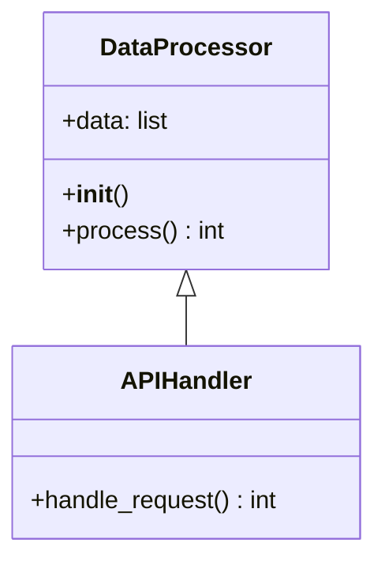

# 🎯 AutoFix Mermaid V3.4

**智能 Python 程式碼轉 Mermaid 圖表工具**


---

## 🚀 快速開始

### 1️⃣ 啟動應用程式
```bash
# 切換到專案目錄
cd "C:\D\Autofix_Mermaid\autofix_mermaidV3.4"

# 啟動本地伺服器  
python -m http.server 8080

# 開啟瀏覽器訪問
# http://localhost:8080
```

### 2️⃣ 基本使用
1. **貼上程式碼**：在輸入區域貼上 Python 程式碼或 Mermaid 語法
2. **選擇模式**：自動偵測 / Mermaid / Python
3. **生成圖表**：點擊「自動修正＋渲染」
4. **匯出結果**：點擊「輸出圖片」選擇 SVG 或 PNG 格式

---

## ✨ 主要功能

### 🔍 智能程式碼分析
- **Tree-sitter 支援**：精確的 Python 語法解析
- **自動 Fallback**：無 WASM 環境時自動降級  
- **多語言支援**：Python、Mermaid 語法

### 📊 豐富的圖表類型
- **🌊 Flowchart**：程序流程圖
- **🏗️ Class Diagram**：類別關係圖
- **🔄 Sequence Diagram**：序列互動圖

### 🎨 現代化介面
- **即時預覽**：輸入時自動渲染
- **智能按鈕**：成功後啟用匯出功能
- **格式選擇**：一鍵切換 SVG/PNG 輸出

---

## 🔧 技術架構

### 前端技術
- **JavaScript ES6+**：模組化架構
- **Web Workers**：背景非同步處理  
- **Mermaid.js**：專業圖表渲染
- **Canvas API**：高品質圖片輸出

### 解析引擎  
- **Web Tree-sitter**：語法樹分析
- **Python WASM**：原生 Python 支援
- **智能切換**：最佳解析器選擇

---

## 📁 專案結構

```
autofix_mermaidV3.4/
├── 📄 index.html              # 主應用程式
├── 📁 js/                     # JavaScript 模組
│   ├── main.js               # 應用程式進入點
│   ├── UI.js                 # 使用者介面
│   ├── Renderer.js           # 圖表渲染器
│   ├── worker.js             # 背景處理器
│   ├── vendor/               # 第三方庫
│   │   ├── mermaid.min.js
│   │   └── web-tree-sitter.js ⭐ 新增
│   └── wasm/                 # WebAssembly
│       ├── tree-sitter.wasm ⭐ 新增
│       └── tree-sitter-python.wasm ⭐ 新增
├── 📁 css/                    # 樣式檔案
├── 📁 engine-src/             # TypeScript 原始碼
└── 📚 文檔/                   # 說明文件
```

---

## 🎯 V3.4 新功能

### ⭐ Tree-sitter 整合 (2025.09.11)
- **精確解析**：使用業界標準語法分析器
- **完整支援**：web-tree-sitter.js + Python WASM
- **自動降級**：優雅的備援機制

### 🎨 UI/UX 改進
- **統一控制**：移除重複的尺寸輸入框
- **智能預設**：自動偵測最佳輸出尺寸
- **輸出按鈕**：新增格式選擇功能

### 📊 輸出增強
- **多格式支援**：SVG (向量) + PNG (點陣)
- **背景設定**：透明或自訂顏色
- **智能尺寸**：1024×768px 預設 + 自動偵測

---

## 💡 使用範例

### Python 程式碼 → Class Diagram
```python
class DataProcessor:
    def __init__(self):
        self.data = []
    
    def process(self):
        return len(self.data)

class APIHandler(DataProcessor):
    def handle_request(self):
        return self.process()
```

### 生成的 Mermaid 圖表


---

## 📋 系統需求

### 瀏覽器支援
- Chrome 60+ ✅
- Firefox 60+ ✅  
- Safari 12+ ✅
- Edge 79+ ✅

### 執行環境
- Python 3.x (本地伺服器)
- 支援 ES6 模組的瀏覽器
- WebAssembly 支援 (Tree-sitter)

---

## 🔍 疑難排解

### Q: 輸出按鈕是反灰的？
**A:** 需要先成功渲染圖表，按鈕才會啟用

### Q: 無法載入 ES6 模組？  
**A:** 使用 HTTP 伺服器而非直接開啟 HTML 檔案

### Q: Tree-sitter 載入失敗？
**A:** 系統會自動降級到 fallback 解析器

---

## 📞 支援與貢獻

- **GitHub Repository**: https://github.com/kyle0527/Autofix_Mermaid
- **問題回報**: GitHub Issues
- **維護者**: kyle0527

### 🔄 版本更新
- **V3.4** (2025.09.11): Tree-sitter 支援 + UI 優化
- **V3.3**: ES6 模組化 + Web Workers  
- **V3.2**: TypeScript 重構
- **V3.1**: 基礎功能實作

---

## 📜 授權條款

本專案採用 MIT 授權條款

---

**🎉 讓 Python 程式碼視覺化變得簡單！**

[](https://github.com/kyle0527)
[](https://github.com/kyle0527/Autofix_Mermaid)
