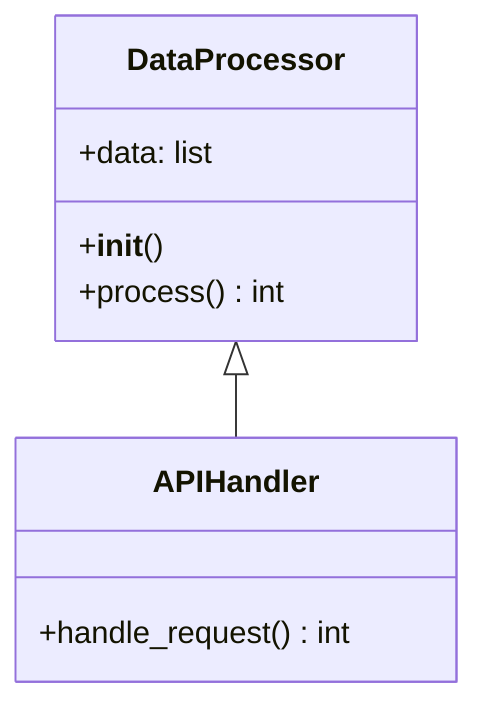

# 🎯 AutoFix Mermaid v3.7

**智能 Python 程式碼轉 Mermaid 圖表工具**


> 延伸詳細功能與里程碑請見： [FEATURES_AND_ROADMAP.md](./FEATURES_AND_ROADMAP.md)

---

## 🚀 快速開始

### 1️⃣ 啟動應用程式
```bash
# 切換到專案目錄
cd "C:\D\Autofix_Mermaid\autofix_mermaidV3.4"

# 啟動本地伺服器  
python -m http.server 8080

# 開啟瀏覽器訪問
# http://localhost:8080
```

### 2️⃣ 基本使用
1. **貼上程式碼**：在輸入區域貼上 Python 程式碼或 Mermaid 語法
2. **選擇模式**：自動偵測 / Mermaid / Python
3. **生成圖表**：點擊「自動修正＋渲染」
4. **匯出結果**：點擊「輸出圖片」選擇 SVG 或 PNG 格式

---

## ✨ 主要功能

### 🔍 智能程式碼分析
- **Tree-sitter 支援**：精確的 Python 語法解析
- **自動 Fallback**：無 WASM 環境時自動降級  
- **多語言支援**：Python、Mermaid 語法

### 📊 豐富的圖表類型
- **🌊 Flowchart**：程序流程圖
- **🏗️ Class Diagram**：類別關係圖
- **🔄 Sequence Diagram**：序列互動圖

### 🎨 現代化介面
- **即時預覽**：輸入時自動渲染
- **智能按鈕**：成功後啟用匯出功能
- **格式選擇**：一鍵切換 SVG/PNG 輸出

---

---

## 🧭 商用願景與目標 (Business Vision)

本專案正向「可商用的全程 UI 自動化程式架構→Mermaid 圖表平台」演進，核心價值：
1. 多語言程式碼靜態/半動態分析
2. 自動生成並修正符合規範的 Mermaid 語法
3. 視覺化預覽 + 互動調整 + 圖檔匯出
4. 可插拔規則 (Rule Pack) 與提示模板 (Prompt Pack) 擴充
5. 企業級使用情境：團隊共用、知識沉澱、文件即程式架構真實狀態

---

## 🧬 核心能力對應需求

| 使用者需求 | 對應能力 | 現況 | 規劃 |
|-------------|----------|------|------|
| 1. 分析不同程式語言 | Tree-sitter 多語法 / 語言適配層 | Python 部分 | 擴充到 JS/TS、Java、Go、C#, 以插件形式載入 grammar |
| 2. 解析程式架構 | AST → 中介模型 (Intermediate Representation, IR) | 初步類別/函式抽取 | 引入關聯 (呼叫圖 / 依賴圖) 聚合與分層視圖 |
| 3. 產出與修正 Mermaid | Autofix 規則 + 正則/AST 修復 | Flowchart/Class 基礎 | 規範檢查 (lint) + 自動格式化 + 視覺差異提示 |
| 4. 排列組合/渲染/匯出 | Mermaid.js + 自訂佈局策略 | 基礎渲染 + PNG/SVG | 多視圖 (模組依賴 / 呼叫圖 / 時序) + PDF + 批次匯出 |
| 5. 商用 + 全 UI 操作 | Web 前端 + Worker | 單頁工具 | 多專案管理 / 角色權限 / 報表匯出 |

---

## 🏗️ 架構解析流程 (高層 Pipeline)

```mermaid
flowchart LR
    A[輸入來源\n1. 上傳資料夾\n2. 貼上程式碼\n3. Mermaid 語法] --> B[語言偵測 / 模式選擇]
    B --> C[語法解析層\nTree-sitter / Fallback Parser]
    C --> D[AST 正規化\n→ IR 統一抽象模型]
    D --> E[規則引擎\nRulePack + PromptPack]
    E --> F[Mermaid 生成器]
    F --> G[自動修正 / Lint / 格式化]
    G --> H[即時預覽渲染]
    H --> I{使用者操作?}
    I -->|調整樣式/篩選| F
    I -->|匯出| J[SVG / PNG / (未來) PDF / ZIP]
```

---

## 🧩 Mermaid 語法生成策略

1. AST 映射：以語言中立 IR（類別、介面、函式、模組）映射到 Mermaid 類型 (classDiagram / flowchart / sequenceDiagram / erDiagram …)。
2. 規則層：
     - Lint：檢查標頭、方向、命名格式
     - Autofix：缺失宣告補齊、過時語法升級 (graph → flowchart) 、節點標籤正規化
3. 格式化：行寬控制、節點排序（字母序 / 依依賴拓樸 / 分群）。
4. 未來：自訂佈局策略（分層 / 分群 / 隱藏低權重節點）。

---

## 🛠️ 排列組合 / 互動調整
未來提供 UI 操作介面：
- 節點顯示/隱藏 (Filter)
- 聚合 (Collapse Modules / Packages)
- Tag / Domain 分色
- 自訂布局：LR / TB 以及自動層級分群
- 多個 Diagram 批次產出（例：Class + Call + Sequence）

---

## 📤 匯出與整合計畫
| 格式 | 現況 | 規劃 | 技術要點 |
|------|------|------|----------|
| SVG | ✅ | 強化樣式內嵌 | Mermaid 原生 + Cleanup + metadata |
| PNG | ✅ | 支援透明/背景設定 | Canvas drawImage + toBlob |
| PDF | 🔜 | 單圖 / 多頁合併 | pdf-lib / jsPDF |
| ZIP | 🔜 | 整批打包 | JSZip |
| JSON IR | 🔜 | 開放 API | IR schema export |

---

## 🔐 商用延伸 (Enterprise Roadmap)
| 項目 | 階段 | 描述 |
|------|------|------|
| 使用者 / 角色 | Phase 2 | Viewer / Editor / Admin 權限 |
| 專案工作區 | Phase 2 | 多專案隔離、標籤、版本快照 |
| 差異比對 | Phase 3 | 兩個 Git commit 產生架構 Diff Mermaid |
| 自動週報 | Phase 3 | 排程重新解析 + 生成更新報表 |
| API / SaaS | Phase 4 | REST / GraphQL 提供雲端解析與圖表生成 |
| SSO / RBAC | Phase 4 | 企業整合 (OIDC / SAML) |

---

## 🧪 測試策略 (未來擴充)
| 類型 | 範例 | 工具 |
|------|------|------|
| 單元 | 修正器、語法偵測 | node:test / vitest |
| 快照 | Mermaid 文字輸出 | snapshot files |
| 互動 | UI 產出 / 匯出按鈕 | Playwright |
| 整合 | 上傳 → 解析 → 生成 → 匯出 | Playwright + Mock FS |
| 效能 | 大型程式碼庫解析 | Benchmark runner |

---

## 🗺️ 短中長期 Roadmap 摘要
| 時程 | 重點 | 內容 |
|------|------|------|
| 短期 (0-1月) | 多語言起步 | 加 JS/TS Grammar、IR 雛形、Flowchart/Class 強化 |
| 中期 (1-3月) | 擴充架構 | 呼叫圖、依賴圖、Batch 匯出、CLI 工具 |
| 中長期 (3-6月) | 協作 & 商用 | 專案管理、差異分析、雲端 API、權限 |
| 長期 (6月+) | 平台化 | SaaS、多租戶、插件市集 |

---

## 🧾 授權 & 商用聲明
基礎核心以 MIT 釋出；未來企業附加模組（RBAC、多專案同步、雲端 API）可能採雙授權模式。若有商用需求可先行提出 Issue 洽談。

---

## 🔧 技術架構

### 前端技術
- **JavaScript ES6+**：模組化架構
- **Web Workers**：背景非同步處理  
- **Mermaid.js**：專業圖表渲染
- **Canvas API**：高品質圖片輸出

### 解析引擎  
- **Web Tree-sitter**：語法樹分析
- **Python WASM**：原生 Python 支援
- **智能切換**：最佳解析器選擇

---

## 📁 專案結構

```
autofix_mermaidV3.4/
├── 📄 index.html              # 主應用程式
├── 📁 js/                     # JavaScript 模組
│   ├── main.js               # 應用程式進入點
│   ├── UI.js                 # 使用者介面
│   ├── Renderer.js           # 圖表渲染器
│   ├── worker.js             # 背景處理器
│   ├── vendor/               # 第三方庫
│   │   ├── mermaid.min.js
│   │   └── web-tree-sitter.js ⭐ 新增
│   └── wasm/                 # WebAssembly
│       ├── tree-sitter.wasm ⭐ 新增
│       └── tree-sitter-python.wasm ⭐ 新增
├── 📁 css/                    # 樣式檔案
├── 📁 engine-src/             # TypeScript 原始碼
└── 📚 文檔/                   # 說明文件
```

---

## 🎯 V3.4 新功能

### ⭐ Tree-sitter 整合 (2025.09.11)
- **精確解析**：使用業界標準語法分析器
- **完整支援**：web-tree-sitter.js + Python WASM
- **自動降級**：優雅的備援機制

### 🎨 UI/UX 改進
- **統一控制**：移除重複的尺寸輸入框
- **智能預設**：自動偵測最佳輸出尺寸
- **輸出按鈕**：新增格式選擇功能

### 📊 輸出增強
- **多格式支援**：SVG (向量) + PNG (點陣)
- **背景設定**：透明或自訂顏色
- **智能尺寸**：1024×768px 預設 + 自動偵測

---

## 💡 使用範例

### Python 程式碼 → Class Diagram
```python
class DataProcessor:
    def __init__(self):
        self.data = []
    
    def process(self):
        return len(self.data)

class APIHandler(DataProcessor):
    def handle_request(self):
        return self.process()
```

### 生成的 Mermaid 圖表


---

## 📋 系統需求

### 瀏覽器支援
- Chrome 60+ ✅
- Firefox 60+ ✅  
- Safari 12+ ✅
- Edge 79+ ✅

### 執行環境
- Python 3.x (本地伺服器)
- 支援 ES6 模組的瀏覽器
- WebAssembly 支援 (Tree-sitter)

---

## 🔍 疑難排解

### Q: 輸出按鈕是反灰的？
**A:** 需要先成功渲染圖表，按鈕才會啟用

### Q: 無法載入 ES6 模組？  
**A:** 使用 HTTP 伺服器而非直接開啟 HTML 檔案

### Q: Tree-sitter 載入失敗？
**A:** 系統會自動降級到 fallback 解析器

---

## 📞 支援與貢獻

- **GitHub Repository**: https://github.com/kyle0527/Autofix_Mermaid
- **問題回報**: GitHub Issues
- **維護者**: kyle0527

### 🔄 版本更新
- **V3.4** (2025.09.11): Tree-sitter 支援 + UI 優化
- **V3.3**: ES6 模組化 + Web Workers  
- **V3.2**: TypeScript 重構
- **V3.1**: 基礎功能實作

---

## 📜 授權條款

本專案採用 MIT 授權條款

---

**🎉 讓 Python 程式碼視覺化變得簡單！**

[](https://github.com/kyle0527)
[](https://github.com/kyle0527/Autofix_Mermaid)
