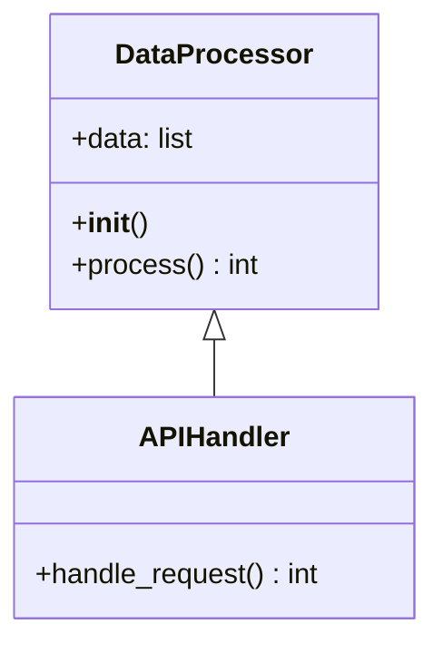

# 🎯 AutoFix Mermaid v3.7

**智能 Python 程式碼轉 Mermaid 圖表工具**


> 延伸詳細功能與里程碑請見： [FEATURES_AND_ROADMAP.md](./FEATURES_AND_ROADMAP.md)

---

## 🚀 快速開始

### 1️⃣ 啟動應用程式

**快速雙擊啟動（桌面封裝）**
```bash
# 在專案根目錄執行
npm install
npm run build:engine          # 產生瀏覽器端分析引擎 bundle
npm run package:desktop       # 以 pkg 打包跨平台可執行檔

# dist/ 目錄會輸出對應平台的可執行檔，
# 下載或複製後即可直接雙擊啟動。
```

**開發 / 本地伺服器模式**
```bash
# 在專案根目錄執行
npm install
npm run build:engine          # 首次或更新後請先建立 bundle
npm run launch                # 自動啟動內建伺服器並開啟預設瀏覽器

# 若偏好手動方式，可改用：
# npm start                   # 啟動內建靜態伺服器
# 或 python -m http.server 8080
# 之後造訪 http://localhost:8080
```

### 2️⃣ 基本使用
1. **貼上程式碼或上傳資料夾**：輸入區域支援 Python、Mermaid 或自動偵測。
2. **選擇解析引擎**：使用工具列的「Rules / AI」切換 worker 管線與提供者。
3. **挑選規則版本**：在配置面板選擇 manifest 內的 RulePack/PromptPack 版本（預設使用最新）。
4. **生成圖表**：點擊「直接渲染」或「自動修正＋渲染」，自動套用預處理規則後渲染。
5. **匯出結果**：成功渲染後可下載 MMD、SVG、PNG、錯誤與修正日誌等檔案。

### 3️⃣ 驗證環境
```bash
# 在專案根目錄執行
npm run build:engine
npm run lint
npm run test
npm run validate:schema
npm run validate:packs
```


---

## ✨ 主要功能

### 🔍 智能程式碼分析
- **Worker 管線**：UI 與 `js/worker.js` / `js/worker.mjs` 對接，可在規則與 AI 模式間切換。
- **Mermaid 預處理**：RulePack `preprocess` 規則會在直接渲染前自動修正常見語法。
- **自動 Fallback**：無 WASM / engine 時改走規則或 AI mock 管線。

### 📊 規則與提示包管理
- **Manifest 駕馭**：`rules/manifest.json` 定義版本、來源與預設 Pack。
- **版本選擇器**：配置面板提供 RulePack/PromptPack 切換，並顯示產生時間與來源資訊。
- **AJV 驗證**：載入時與 CI 皆會使用 JSON Schema 驗證 Rule/Prompt 資料。

### 🎨 現代化介面
- **即時預覽與自動渲染**：輸入或設定變更時可自動觸發渲染。
- **面板快取**：Docs / Config 面板記憶上次開啟狀態與選擇的說明文件。
- **匯出流程**：僅在成功渲染後啟用按鈕，支援 SVG、PNG、MMD 與錯誤/修正記錄

---

## ⚠️ 開發注意事項與檢查清單

> **重要**：執行任何修改前後，請務必進行以下檢查以減少後續 Debug 工程！

### 🔍 執行前檢查清單

#### Mermaid 圖表相關
- [ ] **檢查節點 ID 命名**：是否使用了 Mermaid 保留關鍵字？
  - ❌ 避免：`end`, `start`, `class`, `id`, `graph`, `subgraph`
  - ✅ 建議：`endNode`, `startNode`, `classNode`, `idNode`
- [ ] **圖表類型宣告**：每個 `mermaid` 程式碼塊是否有正確的類型宣告？
  - ✅ 必須：`flowchart TD`、`classDiagram`、`sequenceDiagram`
- [ ] **註解語法**：是否混用了不同的註解格式？
  - ❌ 避免：HTML 註解 `<!-- -->`、Markdown 註解 `[//]: #`
  - ✅ 使用：Mermaid 註解 `%% 註解內容`

#### TypeScript/JavaScript 相關
- [ ] **類型註解**：回調函數參數是否有明確類型？
  - ❌ 避免：`array.forEach((item, index) => ...)`
  - ✅ 使用：`array.forEach((item: Type, index: number) => ...)`
- [ ] **模組引用**：是否引用了不存在或未編譯的模組？
- [ ] **tsconfig.json 配置**：輸出路徑是否與源碼路徑衝突？
- [ ] **Monorepo 工作區**：`@diagrammender/*` 模組路徑是否正確配置？
- [ ] **TypeScript 類型庫**：是否移除了有問題的 `"types": ["node"]` 配置？
- [ ] **Null 安全檢查**：物件屬性存取是否有適當的 null 檢查？

#### 檔案結構相關
- [ ] **路徑引用**：跨平台路徑分隔符是否正確處理？
- [ ] **編碼格式**：檔案是否使用 UTF-8 編碼？
- [ ] **換行符**：是否統一使用 LF 或 CRLF？

### 🧪 執行後驗證清單

#### 功能驗證
- [ ] **Mermaid 渲染**：所有圖表是否能正常渲染？
- [ ] **TypeScript 編譯**：是否有編譯錯誤或警告？
- [ ] **JavaScript 執行**：瀏覽器控制台是否有錯誤？

#### 語法驗證
- [ ] **Mermaid 語法檢查**：使用 Mermaid 驗證工具確認語法正確性
- [ ] **ESLint 檢查**：執行 `npm run lint` 確認程式碼品質
- [ ] **TypeScript 檢查**：執行 `tsc --noEmit` 進行類型檢查
- [ ] **Schema 驗證**：執行 `npm run validate:schema` 確認 RulePack/PromptPack 格式正確
- [ ] **Schema 單元測試**：執行 `npm run test:schema` 驗證 Schema 驗證功能
- [ ] **批量 Mermaid 測試**：運行 `python3 tests/fix_examples.py` 驗證所有圖表
- [ ] **模組編譯測試**：確認 engine-src 和 DiagramMender_plus 兩個工作區都能編譯成功

#### 相容性檢查
- [ ] **瀏覽器相容**：在主流瀏覽器中測試功能
- [ ] **Node.js 版本**：確認使用的 Node.js 版本符合需求 (>=18)
- [ ] **依賴版本**：檢查 package.json 中的依賴版本是否相容

### 🔧 常見問題快速參考

1. **Mermaid 圖表不顯示**
   - 檢查是否有語法錯誤 → 參考 `NOTE.md` 中的修復方法
   - 確認是否有 `flowchart TD` 宣告
   - 避免使用 `end` 作為節點名稱（改為 `endNode`）
   - 移除 HTML 註釋和 Markdown 標記

2. **TypeScript 編譯失敗**
   - 檢查 tsconfig.json 配置 → 參考專案中的標準配置
   - 確認所有參數都有明確類型註解
   - 移除 `"types": ["node"]` 避免類型定義衝突
   - 使用 `moduleResolution: "bundler"` 而非 `"node"`

3. **模組找不到錯誤 (@diagrammender/*)**
   - 確認 workspace 根目錄的 package.json 配置
   - 檢查 tsconfig.json 中的 baseUrl 和 paths 設定
   - 使用相對路徑或臨時類型定義作為備案
   - 確保 monorepo 結構正確建立

4. **GitHub Actions YAML 錯誤**
   - 確認縮排使用空格而非 Tab
   - 檢查 YAML 語法結構正確性
   - 驗證動作名稱和參數格式

5. **Python 類型註解問題**
   - 確保使用 Python 3.6+ 支援的類型提示語法
   - 檢查 import 語句中的類型引入
   - 考慮向後相容性需求

> 💡 **提示**：詳細的修復步驟和解決方案請參考 [NOTE.md](./NOTE.md) 檔案

---

## 🧭 商用願景與目標 (Business Vision)

本專案正向「可商用的全程 UI 自動化程式架構→Mermaid 圖表平台」演進，核心價值：
1. 多語言程式碼靜態/半動態分析
2. 自動生成並修正符合規範的 Mermaid 語法
3. 視覺化預覽 + 互動調整 + 圖檔匯出
4. 可插拔規則 (Rule Pack) 與提示模板 (Prompt Pack) 擴充
5. 企業級使用情境：團隊共用、知識沉澱、文件即程式架構真實狀態

---

## 🧬 核心能力對應需求

| 使用者需求 | 對應能力 | 現況 | 規劃 |
|-------------|----------|------|------|
| 1. 分析不同程式語言 | Tree-sitter 多語法 / 語言適配層 | Python 部分 | 擴充到 JS/TS、Java、Go、C#, 以插件形式載入 grammar |
| 2. 解析程式架構 | AST → 中介模型 (Intermediate Representation, IR) | 初步類別/函式抽取 | 引入關聯 (呼叫圖 / 依賴圖) 聚合與分層視圖 |
| 3. 產出與修正 Mermaid | Autofix 規則 + 正則/AST 修復 | Flowchart/Class 基礎 | 規範檢查 (lint) + 自動格式化 + 視覺差異提示 |
| 4. 排列組合/渲染/匯出 | Mermaid.js + 自訂佈局策略 | 基礎渲染 + PNG/SVG | 多視圖 (模組依賴 / 呼叫圖 / 時序) + PDF + 批次匯出 |
| 5. 商用 + 全 UI 操作 | Web 前端 + Worker | 單頁工具 | 多專案管理 / 角色權限 / 報表匯出 |

---

## 📋 Schema 驗證系統

本專案採用嚴格的 JSON Schema 驗證機制，確保 RulePack 和 PromptPack 配置檔案的正確性與一致性。

### 🔍 支援的驗證類型

1. **RulePack 驗證** (`rules/rulepack.json`)
   - 嚴格驗證必填欄位：`rule_id`, `enabled`, `diagram_types`, `phase`, `pattern_kind`, `fix_action`
   - 資料類型檢查：確保 `enabled` 為布林值、`pattern_kind` 為允許的枚舉值等
   - 結構完整性：驗證巢狀物件 `condition_json`, `fix_params_json` 格式

2. **PromptPack 驗證** (`rules/promptpack.json`)
   - 必填欄位驗證：`prompt_id`, `intent`, `input_type`, `template`
   - 版本一致性：確保 `version` 欄位存在且格式正確
   - 範本完整性：驗證提示範本結構

### 🚀 快速驗證指令

```bash
# 執行完整的 Schema 驗證
npm run validate:schema

# 僅執行 Schema 驗證相關測試
npm run test:schema

# 執行完整測試套件（包含 Schema 驗證）
npm test
```

### 🧪 測試壞樣本

專案包含多個故意設計的錯誤樣本，用於驗證 Schema 驗證的有效性：
- `rules/rulepack.bad1.json` - 缺少必填欄位測試
- `rules/rulepack.bad2.json` - 資料類型錯誤測試  
- `rules/promptpack.bad1.json` - PromptPack 錯誤測試

### 📝 錯誤訊息範例

當驗證失敗時，系統會提供清晰可讀的錯誤訊息：

```
❌ 驗證失敗: ./rules/rulepack.bad1.json
data/rules/0 must have required property 'enabled'

❌ 驗證失敗: ./rules/rulepack.bad2.json  
data/rules/0/enabled must be boolean
data/rules/0/pattern_kind must be equal to one of the allowed values
```

### 🔄 CI/CD 整合

Schema 驗證已整合至 GitHub Actions CI 流程中，確保所有 Pull Request 都必須通過嚴格的 Schema 驗證才能合併。

---

## 🏗️ 架構解析流程 (高層 Pipeline)

```mermaid
flowchart LR
    A[輸入來源\n1. 上傳資料夾\n2. 貼上程式碼\n3. Mermaid 語法] --> B[語言偵測 / 模式選擇]
    B --> C[語法解析層\nTree-sitter / Fallback Parser]
    C --> D[AST 正規化\n→ IR 統一抽象模型]
    D --> E[規則引擎\nRulePack + PromptPack]
    E --> F[Mermaid 生成器]
    F --> G[自動修正 / Lint / 格式化]
    G --> H[即時預覽渲染]
    H --> I{使用者操作?}
    I -->|調整樣式/篩選| F
    I -->|匯出| J[SVG / PNG / (未來) PDF / ZIP]
```

---

## 🧩 Mermaid 語法生成策略

1. AST 映射：以語言中立 IR（類別、介面、函式、模組）映射到 Mermaid 類型 (classDiagram / flowchart / sequenceDiagram / erDiagram …)。
2. 規則層：
     - Lint：檢查標頭、方向、命名格式
     - Autofix：缺失宣告補齊、過時語法升級 (graph → flowchart) 、節點標籤正規化
3. 格式化：行寬控制、節點排序（字母序 / 依依賴拓樸 / 分群）。
4. 未來：自訂佈局策略（分層 / 分群 / 隱藏低權重節點）。

---

## 🛠️ 排列組合 / 互動調整
未來提供 UI 操作介面：
- 節點顯示/隱藏 (Filter)
- 聚合 (Collapse Modules / Packages)
- Tag / Domain 分色
- 自訂布局：LR / TB 以及自動層級分群
- 多個 Diagram 批次產出（例：Class + Call + Sequence）

---

## 📤 匯出與整合計畫
| 格式 | 現況 | 規劃 | 技術要點 |
|------|------|------|----------|
| SVG | ✅ | 強化樣式內嵌 | Mermaid 原生 + Cleanup + metadata |
| PNG | ✅ | 支援透明/背景設定 | Canvas drawImage + toBlob |
| PDF | 🔜 | 單圖 / 多頁合併 | pdf-lib / jsPDF |
| ZIP | 🔜 | 整批打包 | JSZip |
| JSON IR | 🔜 | 開放 API | IR schema export |

---

## 🔐 商用延伸 (Enterprise Roadmap)
| 項目 | 階段 | 描述 |
|------|------|------|
| 使用者 / 角色 | Phase 2 | Viewer / Editor / Admin 權限 |
| 專案工作區 | Phase 2 | 多專案隔離、標籤、版本快照 |
| 差異比對 | Phase 3 | 兩個 Git commit 產生架構 Diff Mermaid |
| 自動週報 | Phase 3 | 排程重新解析 + 生成更新報表 |
| API / SaaS | Phase 4 | REST / GraphQL 提供雲端解析與圖表生成 |
| SSO / RBAC | Phase 4 | 企業整合 (OIDC / SAML) |

---

## 🧪 測試策略 (未來擴充)
| 類型 | 範例 | 工具 |
|------|------|------|
| 單元 | 修正器、語法偵測 | node:test / vitest |
| 快照 | Mermaid 文字輸出 | snapshot files |
| 互動 | UI 產出 / 匯出按鈕 | Playwright |
| 整合 | 上傳 → 解析 → 生成 → 匯出 | Playwright + Mock FS |
| 效能 | 大型程式碼庫解析 | Benchmark runner |

---

## 🗺️ 短中長期 Roadmap 摘要
| 時程 | 重點 | 內容 |
|------|------|------|
| 短期 (0-1月) | 多語言起步 | 加 JS/TS Grammar、IR 雛形、Flowchart/Class 強化 |
| 中期 (1-3月) | 擴充架構 | 呼叫圖、依賴圖、Batch 匯出、CLI 工具 |
| 中長期 (3-6月) | 協作 & 商用 | 專案管理、差異分析、雲端 API、權限 |
| 長期 (6月+) | 平台化 | SaaS、多租戶、插件市集 |

---

## 🧾 授權 & 商用聲明
基礎核心以 MIT 釋出；未來企業附加模組（RBAC、多專案同步、雲端 API）可能採雙授權模式。若有商用需求可先行提出 Issue 洽談。

---

## 🔧 技術架構

### 前端技術
- **JavaScript ES6+**：模組化架構
- **Web Workers**：背景非同步處理  
- **Mermaid.js**：專業圖表渲染
- **Canvas API**：高品質圖片輸出

### 解析引擎  
- **Web Tree-sitter**：語法樹分析
- **Python WASM**：原生 Python 支援
- **智能切換**：最佳解析器選擇

---

## 📁 專案結構

```
Autofix_Mermaid/
├── 📄 index.html              # 主應用程式入口
├── 📁 js/                     # UI、渲染與 worker 模組
│   ├── main.js               # 初始化入口
│   ├── UI.js / app.js        # 互動與面板控制
│   ├── rules/                # RulePack 客戶端工具
│   ├── worker.js / worker.mjs# 規則/AI worker 實作
│   └── engine/               # 規則驗證器等核心模組
├── 📁 rules/                  # 版本化 Rule/Prompt packs
│   ├── manifest.json         # Pack 清單與預設版本
│   ├── rulepack.json         # 預設規則包快取
│   └── versions/             # 版本化輸出（build-packs 產生）
├── 📁 scripts/               # 自動化腳本
│   ├── run-tests.js          # lint/schema/fixtures 測試入口
│   └── build-packs.mjs       # XLSX → JSON 轉換
├── 📁 tests/                 # Node 測試套件
│   ├── schema-validation.mjs # AJV 驗證三組壞樣本
│   └── rules-pipeline.mjs    # 預處理規則範例驗證
├── 📁 docs/                  # 使用文件與技術地圖（含 docs/legacy/）
└── 📄 package.json           # npm 腳本與依賴
```

---

## 🎯 V3.4 新功能

### ⭐ Tree-sitter 整合 (2025.09.11)
- **精確解析**：使用業界標準語法分析器
- **完整支援**：web-tree-sitter.js + Python WASM
- **自動降級**：優雅的備援機制

### 🎨 UI/UX 改進
- **統一控制**：移除重複的尺寸輸入框
- **智能預設**：自動偵測最佳輸出尺寸
- **輸出按鈕**：新增格式選擇功能

### 📊 輸出增強
- **多格式支援**：SVG (向量) + PNG (點陣)
- **背景設定**：透明或自訂顏色
- **智能尺寸**：1024×768px 預設 + 自動偵測

---

## 💡 使用範例

### Python 程式碼 → Class Diagram
```python
class DataProcessor:
    def __init__(self):
        self.data = []
    
    def process(self):
        return len(self.data)

class APIHandler(DataProcessor):
    def handle_request(self):
        return self.process()
```

### 生成的 Mermaid 圖表

```mermaid
classDiagram
    class DataProcessor {
        +data: list
        +__init__()
        +process() int
    }
    class APIHandler {
        +handle_request() int
    }
    DataProcessor <|-- APIHandler
```

---

## 📋 系統需求

### 瀏覽器支援
- Chrome 60+ ✅
- Firefox 60+ ✅  
- Safari 12+ ✅
- Edge 79+ ✅

### 執行環境
- Python 3.x (本地伺服器)
- 支援 ES6 模組的瀏覽器
- WebAssembly 支援 (Tree-sitter)

---

## 🔍 疑難排解

### Q: 輸出按鈕是反灰的？
**A:** 需要先成功渲染圖表，按鈕才會啟用

### Q: 無法載入 ES6 模組？  
**A:** 使用 HTTP 伺服器而非直接開啟 HTML 檔案

### Q: Tree-sitter 載入失敗？
**A:** 系統會自動降級到 fallback 解析器

---

## 📞 支援與貢獻

- **GitHub Repository**: https://github.com/kyle0527/Autofix_Mermaid
- **問題回報**: GitHub Issues
- **維護者**: kyle0527

### 🔄 版本更新
- **V3.4** (2025.09.11): Tree-sitter 支援 + UI 優化
- **V3.3**: ES6 模組化 + Web Workers  
- **V3.2**: TypeScript 重構
- **V3.1**: 基礎功能實作

---

## 📜 授權條款

本專案採用 MIT 授權條款

---

**🎉 讓 Python 程式碼視覺化變得簡單！**

[](https://github.com/kyle0527)
[](https://github.com/kyle0527/Autofix_Mermaid)

## 🧱 規則與 Prompt 匯入管線

- `scripts/build-packs.mjs`：將 `__not_shipped__/data/diagram_knowledge_pack.xlsx` 匯入為 JSON，並寫入
  `rules/versions/<版本>/rulepack.json` 與 `promptpack.json`。預設會更新 `rules/manifest.json` 與根目錄下的
  `rules/rulepack.json`、`rules/promptpack.json`。
- `npm run build:packs`：以專案腳本方式執行 `build-packs.mjs`，方便在 CI 或手動更新時快速重建最新版本的
  RulePack / PromptPack。執行時會沿用 `rules/manifest.json` 指定的結構並自動更新預設版本。
- `npm test`：會執行 Schema 驗證與範例圖測試，確保最新的 RulePack 能修正 `tests/fixtures/rules/examples/`
  內的三個樣本圖；同時也會檢查 Node.js 環境是否成功載入 AJV 驗證器，以避免回落到較寬鬆的備援檢查。結束
  前會呼叫 `node scripts/build-packs.mjs --check`，確保版本庫內的 JSON 與 `__not_shipped__/data/diagram_knowledge_pack.xlsx`
  同步，若有落差則提示重新執行 `npm run build:packs` 更新。
- 前端配置面板提供「規則版本」下拉選單，會根據 `rules/manifest.json` 自動載入版本、標示預設版本，並顯示
  來源與生成時間，供測試不同規則組合時快速切換。
