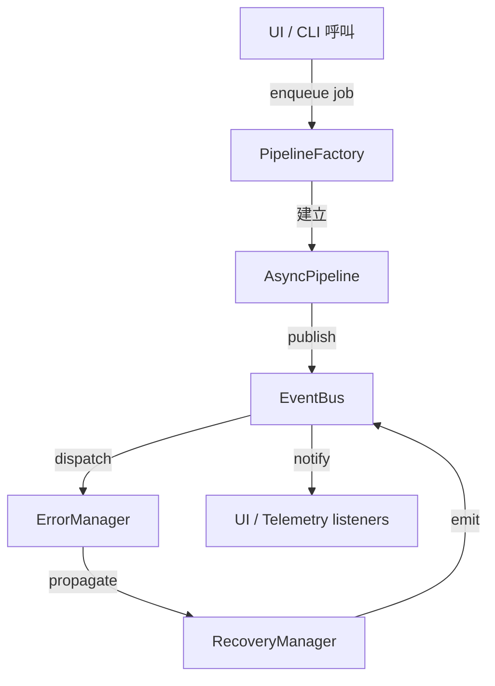

# AutoFix Mermaid 系統架構重整藍圖
> 版本：2025-09-24 | 作者：Architecture Working Group

## 1. 背景摘要

| 議題 | 現況觀察 | 後果 |
| --- | --- | --- |
| 模組耦合度高 | UI、Worker、Pipeline、錯誤處理在同一個執行緒中直接互相呼叫 | 任一子模組失敗即中斷整體流程（例如 Tree-sitter 建構失敗導致渲染停擺） |
| 維護兩套 Worker 管線 | `worker.js`（classic）與 `worker.mjs`（module）並存 | 額外維護成本、行為不一致、配置易漂移 |
| 新舊管線整合未完成 | `AsyncProcessingPipeline` 與既有 `MermaidProcessingPipeline` 僅局部掛載 | 記憶體/錯誤管理無法完整發揮，導致複雜度回滾 |
| 模組化不足 | 規則引擎、解析器、UI 共享同一 JS 執行環境 | 缺少嚴格型別界線，重構阻力大 |

## 2. 重整目標與原則

1. **鬆耦合事件驅動**：所有跨模組互動透過事件總線進行，避免直接依賴。
2. **錯誤隔離與恢復**：任何模組失敗都必須被捕捉、記錄並可復原或降級。
3. **單一來源的處理管線**：透過 `PipelineFactory` 管理同步/異步配置，逐步淘汰經典 worker。
4. **型別化核心**：核心解析與轉換邏輯落地至 `engine-src` TypeScript 套件，UI 保持輕量。
5. **文件與圖示同步**：C4 模圖、流程圖隨實作更新，降低人員溝通成本。

## 3. 模組邊界與責任

| 模組 | 主要職責 | 關鍵介面 |
| --- | --- | --- |
| `ui/` | 呈現、收集使用者輸入、訂閱事件總線 | `eventBus.subscribe`, DOM `CustomEvent`
| `js/engine/event-bus.js` | 單一事件交換中心、維護歷史、對 DOM 廣播 | `publish`, `subscribe`, `once`
| `js/engine/async-processing-pipeline.js` | 任務排程、批次處理、統計追蹤 | 任務事件（`taskStarted`, ...）
| `js/engine/async-pipeline-integration.js` | 將 Mermaid 處理邏輯接上 Async Pipeline、匯出 API | `PipelineFactory`, `processProject`
| `js/engine/error-*.js` | 錯誤上下文、恢復策略、傳播路徑 | `globalErrorManager`
| `engine-src/` | 型別化解析與圖表生成核心（TS） | `@diagrammender/*` bundles
| Worker 層 (`worker.mjs`) | 與 UI 隔離的背景執行環境 | `postMessage`, `eventBus`（之後嵌入）

## 4. 事件驅動整合

### 4.1 事件總線主題

| 類別 | 事件鍵值 | Payload 重點 |
| --- | --- | --- |
| Pipeline | `pipeline.task.*`, `pipeline.batch.*`, `pipeline.stats.updated` | 任務公開資訊（ID、批次、重試次數）、統計數據 |
| Error | `error.isolated`, `error.recovered` | `ErrorContext` JSON, 採取的恢復策略 |
| System | `system.worker.health`, `system.memory.usage` | Worker 心跳、記憶體量測（延伸用） |

所有事件都同時透過 `window.dispatchEvent(new CustomEvent('autofix:event'))` 鏡射，使 UI 能在無 bundler 耦合下監看。

### 4.2 事件流程圖

## 5. 錯誤隔離與恢復

1. **捕捉**：管線任務失敗時建構 `ErrorContext`，並觸發 `PipelineEvents.TASK_FAILED`。
2. **隔離**：`globalErrorManager.propagateError` 記錄錯誤鏈，並透過 `ErrorEvents.ISOLATED` 通知觀察者。
3. **恢復策略**：
	- Tree-sitter 失敗 → 自動降級至 Regex Fallback。
	- 記憶體不足 → `MemoryManager.cleanup()` 後重新排程（指數退避）。
	- 批次錯誤 → 產出失敗清單，允許 UI 單筆重跑。
4. **回報**：所有結果都走事件總線，UI 僅依賴事件而非直接呼叫錯誤模組。

## 6. 管線統一策略

| 階段 | 行動 | 成功條件 |
| --- | --- | --- |
| Phase 1 | 將 `MermaidProcessingPipeline` 全面掛上事件總線與錯誤管理（已完成） | 任務事件、統計與錯誤均透過事件送出 |
| Phase 2 | `PipelineFactory` 決策流程統一，建立 `PipelineProfile`（同步/異步/批次） | UI 只需要傳入 profile 名稱即可選擇管線 |
| Phase 3 | 停用 `worker.js`，在 `worker.mjs` 中注入事件總線與工廠 | module worker 成為唯一背景執行管道 |
| Phase 4 | 加入長駐健康檢查（Worker heartbeat）與自動重啟 | Worker 故障不再影響 UI 主執行緒 |

## 7. TypeScript 模組化路線

1. **拆分**：將 `js/engine/processor.js`、規則引擎相關邏輯搬移至 `engine-src/packages/core`。  
2. **型別定義**：建立共用 `@diagrammender/types` 套件，包含 IR、Rule、Pipeline 介面。  
3. **UI 輕量化**：UI 僅維持事件訂閱與呈現，邏輯改呼叫 `@diagrammender/core` compiled bundle。  
4. **ESM 專一化**：全專案保持原生 ESM，Classic Worker 轉換為 shim 層直到淘汰。  

## 8. 測試與驗證策略

| 項目 | 工具 | 覆蓋面 |
| --- | --- | --- |
| 事件流程驗證 | 新增 Node 單元測試，模擬事件順序、確保一次性監聽釋放 | pipeline 任務、錯誤事件 |
| 錯誤隔離 | `tests/test-error-propagation.js` 擴充案例 | Tree-sitter 失敗、記憶體回收 |
| Worker 健康檢查 | Playwright E2E（未來） | UI 對事件驅動回饋 |
| 型別檢查 | `pnpm --filter engine-src tsc --noEmit` | engine-src TypeScript 完整過關 |

## 9. 遺留清理與移轉步驟

1. **立即項目（本週）**
	- 導入事件總線（本文件對應修正）。
	- 將 `MermaidProcessingPipeline` 統一透過事件回報、錯誤隔離。
	- 文件與 C4 模圖更新。
2. **短期（< 1 個月）**
	- `PipelineFactory` profile 化，導入組態檔管理。
	- `worker.mjs` 接手所有 UI 背景工作，`worker.js` 改成 shim/告警。
	- 擴充 `globalErrorManager` 監控輸出（可串 Grafana/Elastic）。
3. **中期（1-3 個月）**
	- `engine-src` TypeScript 化完成、Rollup/ESBuild 建置 pipeline。
	- 規則與 AI 管線拆分為 plugin-based 架構。
	- 引入多租戶記錄（專案隔離、Role-based 控制）。
4. **長期（> 3 個月）**
	- SaaS 化準備：集中事件收集、外部 API 暴露。
	- 自動化健康檢查與智慧排程（根據記憶體/錯誤率動態調整併發）。

## 10. 後續待辦摘要

- [ ] 新增 `tests/test-event-bus.js` 驗證訂閱/退訂與 DOM 廣播。
- [ ] UI 層切換為只聆聽 `autofix:event` 與 `eventBus.subscribe`。
- [ ] 撰寫 `docs/repair_workflow.md` 補充錯誤恢復情境劇本。
- [ ] 將 `worker.mjs` deprecation 計畫公告於 `CHANGELOG.md`。

---

> 此藍圖會在每個 milestone 結束後回顧與修訂，請於 PR 中引用對應章節確保實作一致。
# architecture.md\n\n(offline minimal placeholder)