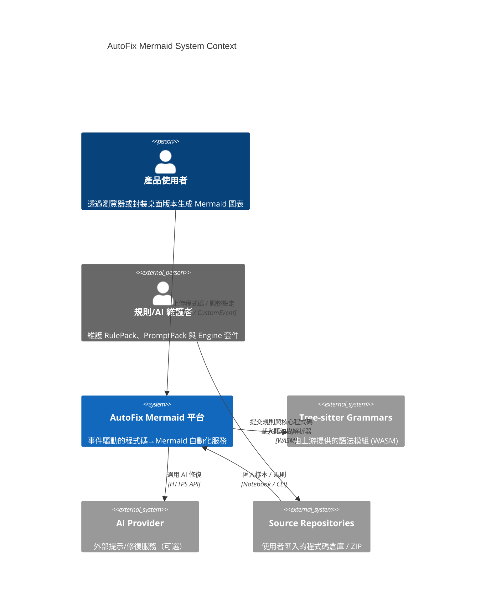
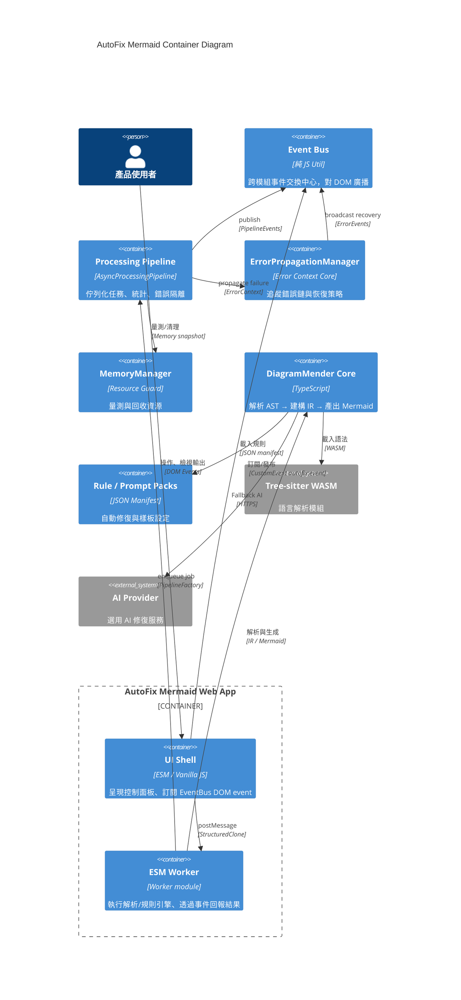

# AutoFix Mermaid C4 模型

> 版本：2025-09-24 | 作者：Architecture Working Group

本文以 C4 方法論描述 AutoFix Mermaid 的高階架構，對應 `docs/architecture.md` 中的重整藍圖。

## 1. 系統脈絡圖（Context）

## 2. 核心容器圖（Container）

## 3. 設計重點對照

| 項目 | C4 元素 | 文件對應 |
| --- | --- | --- |
| 事件總線 | `Event Bus` 容器 | `docs/architecture.md` §4 |
| 錯誤隔離 | `ErrorPropagationManager` 容器 | `docs/architecture.md` §5 |
| 管線統一 | `Processing Pipeline` + `ESM Worker` | `docs/architecture.md` §6 |
| TypeScript 重構 | `DiagramMender Core` | `docs/architecture.md` §7 |

## 4. 後續擴充

- 新增 **Component Diagram** 聚焦 `engine-src` 套件切分（待 TypeScript 重構完成）。
- 新增 **Deployment Diagram** 描述桌面封裝 vs. SaaS 部署差異。
- 若引入雲端事件蒐集，可擴充 System Context 以展示遙測後端。