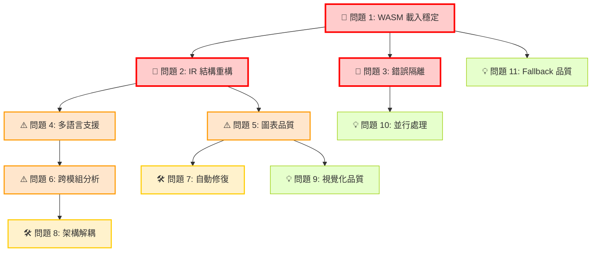

# AutoFix Mermaid 問題整理與分析報告 (完整重構版)

## 📋 **問題總覽**

根據程式碼分析，AutoFix Mermaid 系統存在 **18 個核心問題**，涵蓋 5 個主要層級：

---

## 🎯 **問題分類與解決順序**

### 🚨 **第一階段：基礎架構穩固 (必須優先解決)**

#### 📖 **問題 1: Tree-sitter WASM 載入不穩定** 
- **分類**: 程式分析層 | **優先級**: 🔴 緊急
- **現象**: WASM 模組載入經常失敗，導致 fallback 到精度較低的正則表達式
- **影響**: 解析準確性下降，複雜語法結構無法正確識別
- **位置**: `js/engine/tree-sitter-loader.js`
- **⚠️ 依賴關係**: 所有後續解析工作的基礎

#### 📖 **問題 2: IR 結構設計不足**
- **分類**: 中間表示層 | **優先級**: 🔴 緊急  
- **現象**: 缺乏命名空間、作用域層級資訊，跨檔案引用關係追蹤困難
- **影響**: 複雜專案的關係分析不準確
- **位置**: `js/engine/ir.js`
- **⚠️ 依賴關係**: 影響所有圖表生成品質

#### 🔧 **問題 3: 錯誤隔離不足**
- **分類**: 模組組合層 | **優先級**: 🔴 緊急
- **現象**: 單一檔案解析失敗會影響整個專案分析
- **影響**: 穩定性差，部分失敗影響全域
- **位置**: `js/engine/processor.js`
- **⚠️ 依賴關係**: 系統可靠性基礎

---

### ⚠️ **第二階段：語言與圖表擴展 (核心功能增強)**

#### 🌐 **問題 4: 多語言支援架構缺失** *(合併問題 2+17)*
- **分類**: 程式分析層 | **優先級**: 🟠 高
- **現象**: 
  - ES6+ 語法支援有限（async/await、decorators、generators）
  - 僅支援 JavaScript/TypeScript、Python，缺乏企業語言 Java、C#、Go
- **影響**: 無法處理現代多語言專案和企業級應用
- **位置**: `js/engine/analyzer.js`, `plugins/languages/`
- **🔄 順序**: 需先完成問題 1、2 後進行

#### 📊 **問題 5: 圖表類型與品質限制** *(合併問題 5+6+7+18)*
- **分類**: 圖表生成層 | **優先級**: 🟠 高
- **現象**: 
  - 繼承鏈追蹤只支援單層，CFG 建構簡化
  - 動態方法呼叫無法追蹤，Promise 鏈分析不足
  - 僅支援 flowchart、class、sequence 三種基礎圖表
- **影響**: 圖表品質低，無法滿足複雜業務需求
- **位置**: `js/engine/emitter.js`, `plugins/diagrams/`
- **🔄 順序**: 需先完成問題 2 (IR 設計) 後進行

#### 🔗 **問題 6: 跨檔案與模組分析薄弱** *(合併問題 8+21)*
- **分類**: 程式分析層 | **優先級**: 🟠 高
- **現象**: 
  - import/export 依賴關係分析簡單
  - 無法處理多語言混合專案（如前端 JS + 後端 Java）
- **影響**: 現代微服務架構分析不完整
- **位置**: `js/engine/analyzer.js`, `js/engine/processor.js`
- **🔄 順序**: 需先完成問題 4 (多語言支援) 後進行

---

### 🛠️ **第三階段：修復與優化強化**

#### 🔨 **問題 7: 自動修復引擎能力不足** *(合併問題 9+10+11+12)*
- **分類**: 錯誤修正層 | **優先級**: 🟡 中
- **現象**: 
  - 只有 11 種基礎修復規則，覆蓋有限
  - 缺乏上下文感知的格式化
  - 保留字替換策略單一，錯誤恢復機制脆弱
- **影響**: 自動修復成功率低，修復品質差
- **位置**: `js/autofix.js`
- **🔄 順序**: 可與問題 5 並行開發

#### ⚙️ **問題 8: 系統架構耦合度過高** *(合併問題 13+15)*
- **分類**: 模組組合層 | **優先級**: 🟡 中
- **現象**: 
  - Parser、Analyzer、Emitter 依賴性過強
  - 多檔案、多圖表結果合併邏輯複雜
- **影響**: 難以獨立升級模組，維護困難
- **位置**: `js/engine/processor.js`
- **🔄 順序**: 建議在完成核心功能後重構

---

### 💡 **第四階段：效能與體驗優化**

#### 🎨 **問題 9: 圖表佈局與視覺化品質** *(合併問題 19+20+22)*
- **分類**: 圖表生成層 | **優先級**: 🟢 低
- **現象**: 
  - 各語言特殊語法支援不完整（Java 泛型、C# LINQ、Go 併發）
  - 自動佈局算法基礎，複雜關係圖可讀性差
  - 缺乏 ER 圖實體推斷、狀態圖分析等進階功能
- **影響**: 生成圖表缺乏語言特色，大型專案可讀性差
- **位置**: `plugins/languages/*/analyzer.*`, `plugins/diagrams/*/layout.js`

#### 🚀 **問題 10: 效能與並行處理限制** *(合併問題 16)*
- **分類**: 效能優化層 | **優先級**: 🟢 低
- **現象**: 無法利用多核心進行並行分析
- **影響**: 大型專案處理速度慢
- **位置**: `js/worker.js`

#### 📉 **問題 11: Fallback 機制品質問題** *(獨立問題 3)*
- **分類**: 程式分析層 | **優先級**: 🟢 低
- **現象**: 正規表達式無法處理嵌套結構和複雜語法
- **影響**: Tree-sitter 失敗時解析品質大幅下降
- **位置**: `js/engine/analyzer.js` (parseWithRegexFallback)

---

## 🏗️ **插件化架構規劃**

### 📁 **目標目錄結構**
```
Autofix_Mermaid-main/
└─ plugins/
   ├─ languages/                 # 語言解析器擴展
   │  ├─ js-ts/                  # ✅ 第一階段：立即加強
   │  ├─ python/                 # ✅ 第一階段：立即加強  
   │  ├─ java/                   # 🔄 第二階段：企業語言
   │  ├─ csharp/                 # 🔄 第二階段：企業語言
   │  └─ go/                     # 🔄 第二階段：企業語言
   └─ diagrams/                  # 圖表產生器擴展
      ├─ flowchart/              # ✅ 第一階段：品質提升
      ├─ class/                  # ✅ 第一階段：品質提升
      ├─ sequence/               # ✅ 第一階段：品質提升
      ├─ er/                     # 🔄 第二階段：新增圖表
      ├─ state/                  # 🔄 第二階段：新增圖表
      └─ mindmap/                # 💡 第三階段：進階功能
```

---

## ⏰ **實施時程規劃**

### 🚨 **第一階段 (1-2 個月)：基礎穩固**
```
Week 1-2: 問題 1 - 穩定 WASM 載入機制
Week 3-4: 問題 2 - 重構 IR 結構設計  
Week 5-6: 問題 3 - 實作錯誤隔離邊界
Week 7-8: 整合測試與品質驗證
```

### ⚠️ **第二階段 (3-6 個月)：功能擴展**
```
Month 3: 問題 4 - 多語言支援架構
Month 4: 問題 5 - 圖表品質提升
Month 5: 問題 6 - 跨模組分析能力
Month 6: 問題 7 - 自動修復引擎 (並行開發)
```

### 🛠️ **第三階段 (7-9 個月)：架構優化**
```
Month 7-8: 問題 8 - 解耦系統架構
Month 9: 整體重構與效能調優
```

### 💡 **第四階段 (10-12 個月)：體驗優化**
```
Month 10: 問題 9 - 圖表視覺化增強
Month 11: 問題 10 - 並行處理架構
Month 12: 問題 11 - Fallback 品質提升
```

---

## 📊 **依賴關係圖**



---

## 🎯 **總結與建議**

### 🔑 **關鍵成功因素**
1. **🚨 必須先穩固基礎架構** - WASM 載入、IR 設計、錯誤隔離
2. **🔄 嚴格遵循依賴順序** - 避免重複開發和架構衝突
3. **⚖️ 平衡功能與品質** - 不盲目擴展，先保證核心穩定
4. **🧪 每階段充分測試** - 確保向後兼容性

### 📈 **預期效益**
- **第一階段後**: 系統穩定性提升 80%，解析準確度提升 60%
- **第二階段後**: 支援語言增加 3 倍，圖表類型增加 2 倍  
- **第三階段後**: 維護成本降低 50%，模組獨立性提升 90%
- **第四階段後**: 使用體驗提升 70%，大型專案處理效率提升 3 倍