# AutoFix Mermaid 問題整理與分析報告

## 📋 **問題總覽**

根據程式碼分析，AutoFix Mermaid 在四個主要領域存在 **16 個核心問題**：

### 🔍 **程式分析層問題 (4 個)**

**問題 1: Tree-sitter WASM 載入不穩定**
- 現象: WASM 模組載入經常失敗，導致 fallback 到精度較低的正則表達式
- 影響: 解析準確性下降，複雜語法結構無法正確識別
- 位置: `js/engine/tree-sitter-loader.js`

**問題 2: 語法覆蓋不完整**
- 現象: 複雜的 ES6+ 語法支援有限（async/await、decorators、generators）
- 影響: 現代 JavaScript/TypeScript 專案解析不完整
- 位置: `js/engine/analyzer.js`

**問題 3: Fallback 解析精度低**
- 現象: 正規表達式無法處理嵌套結構和複雜語法
- 影響: 當 Tree-sitter 失敗時，解析品質大幅下降
- 位置: `js/engine/analyzer.js` (parseWithRegexFallback)

**問題 4: IR 結構設計不足**
- 現象: 缺乏命名空間、作用域層級資訊，跨檔案引用關係追蹤困難
- 影響: 複雜專案的關係分析不準確
- 位置: `js/engine/ir.js`

### 🔄 **語法轉換層問題 (4 個)**

**問題 5: 類別關係分析不完整**
- 現象: 繼承鏈追蹤只支援單層，無法處理複雜繼承結構
- 影響: 類別圖生成遺漏重要的繼承關係
- 位置: `js/engine/emitter.js`

**問題 6: 控制流分析缺失**
- 現象: CFG（Control Flow Graph）建構過於簡化
- 影響: 流程圖無法展現真實的程式邏輯流程
- 位置: `js/engine.js` (buildCFG)

**問題 7: 呼叫序列推斷弱**
- 現象: 動態方法呼叫無法追蹤，回調函數和 Promise 鏈分析不足
- 影響: 序列圖生成不準確
- 位置: `js/engine/emitter.js`

**問題 8: 跨模組分析簡化**
- 現象: import/export 依賴關係過於簡單，動態 import 支援不足
- 影響: 大型專案的模組關係圖不完整
- 位置: `js/engine/analyzer.js`

### 🛠️ **錯誤修正層問題 (4 個)**

**問題 9: 修復規則覆蓋有限**
- 現象: 目前只有 11 種基礎修復規則，無法處理複雜語法錯誤
- 影響: 自動修復成功率低
- 位置: `js/autofix.js`

**問題 10: 格式化缺乏上下文感知**
- 現象: 缺乏程式碼風格感知，無法維持原有排版邏輯
- 影響: 修復後的圖表可讀性差
- 位置: `js/autofix.js` (normalizeFormatting)

**問題 11: 關鍵字衝突處理單一**
- 現象: 保留字替換策略過於機械化，無法保持語義意義
- 影響: 節點命名失去原有含義
- 位置: `js/autofix.js` (fixNodeIds)

**問題 12: 錯誤恢復機制脆弱**
- 現象: 修復失敗時缺乏漸進式降級策略
- 影響: 單一錯誤可能導致整個修復流程失敗
- 位置: `js/autofix.js`

### 🏗️ **模組組合層問題 (4 個)**

**問題 13: 階段間耦合度高**
- 現象: Parser、Analyzer、Emitter 之間依賴性過強
- 影響: 難以獨立替換或升級單一模組
- 位置: `js/engine/processor.js`

**問題 14: 錯誤隔離不足**
- 現象: 單一檔案解析失敗會影響整個專案分析
- 影響: 穩定性差，部分失敗影響全域
- 位置: `js/engine/processor.js`

**問題 15: 結果整合複雜**
- 現象: 多檔案、多圖表類型的結果合併邏輯複雜
- 影響: 大型專案的輸出管理困難
- 位置: `js/engine/processor.js`

**問題 16: 並行處理能力缺失**
- 現象: 無法利用多核心進行並行分析
- 影響: 大型專案處理速度慢
- 位置: `js/worker.js`

### 🔧 **語言和圖表支援擴展問題 (6 個)**

**問題 17: 語言解析器覆蓋不足**
- 現象: 目前僅支援 JavaScript/TypeScript、Python，企業常用語言 Java、C#、Go 支援缺失
- 影響: 無法處理多語言大型專案，限制企業級應用
- 位置: `js/engine/analyzer.js`

**問題 18: 圖表類型單一**
- 現象: 僅支援 flowchart、class、sequence 三種基礎圖表類型
- 影響: 無法滿足複雜業務需求，如資料庫設計、狀態機分析、系統概覽
- 位置: `js/engine/emitter.js`

**問題 19: 語言特性分析淺層**
- 現象: 各語言特殊語法支援不完整（如 Java 泛型、C# LINQ、Go 併發）
- 影響: 生成的圖表缺少語言特色，無法展現完整架構
- 位置: `plugins/languages/*/analyzer.*`

**問題 20: 圖表佈局算法簡單**
- 現象: 自動佈局算法過於基礎，複雜關係圖可讀性差
- 影響: 大型專案圖表擁擠，難以理解
- 位置: `plugins/diagrams/*/layout.js`

**問題 21: 跨語言專案支援缺失**
- 現象: 無法處理多語言混合專案（如前端 JS + 後端 Java）
- 影響: 現代微服務架構分析不完整
- 位置: `js/engine/processor.js`

**問題 22: 進階圖表功能缺失**
- 現象: 缺乏 ER 圖的實體關係推斷、狀態圖的狀態機分析、心智圖的智能分群
- 影響: 無法支援資料庫設計、業務流程建模等進階需求
- 位置: `plugins/diagrams/*/emitter.js`

## 🎯 **優先級分級**

### 🚨 **高優先級 (影響核心功能)**
- 問題 1: Tree-sitter WASM 載入不穩定
- 問題 4: IR 結構設計不足  
- 問題 9: 修復規則覆蓋有限
- 問題 14: 錯誤隔離不足
- 問題 17: 語言解析器覆蓋不足
- 問題 21: 跨語言專案支援缺失

### ⚠️ **中優先級 (影響使用體驗)**
- 問題 2: 語法覆蓋不完整
- 問題 6: 控制流分析缺失
- 問題 8: 跨模組分析簡化
- 問題 13: 階段間耦合度高
- 問題 18: 圖表類型單一
- 問題 19: 語言特性分析淺層

### 💡 **低優先級 (優化改進)**
- 問題 3: Fallback 解析精度低
- 問題 5: 類別關係分析不完整
- 問題 7: 呼叫序列推斷弱
- 問題 10: 格式化缺乏上下文感知
- 問題 11: 關鍵字衝突處理單一
- 問題 12: 錯誤恢復機制脆弱
- 問題 15: 結果整合複雜
- 問題 16: 並行處理能力缺失
- 問題 20: 圖表佈局算法簡單
- 問題 22: 進階圖表功能缺失

## 🔧 **建議改進方案**

### 🚀 **插件化架構擴展計劃**

#### 📁 **Plugins 目錄結構**
```
Autofix_Mermaid-main/
└─ plugins/
   ├─ languages/                 # 語言解析器（AST 抽象層）
   │  ├─ js-ts/                  # ✅ 立即支援
   │  │  ├─ parser.js            # Tree-sitter JavaScript/TypeScript 解析器
   │  │  ├─ analyzer.js          # ES6+、Async/Await、Decorators 分析
   │  │  └─ ir-mapper.js         # IR 映射規則
   │  ├─ python/                 # ✅ 立即支援
   │  │  ├─ parser.py            # Python AST 解析器
   │  │  ├─ analyzer.py          # Classes、Functions、Modules 分析
   │  │  └─ ir-mapper.py         # IR 映射規則
   │  ├─ java/                   # ◇ 中期擴展
   │  │  ├─ parser.java          # Java 語法解析
   │  │  ├─ analyzer.java        # OOP 結構分析
   │  │  └─ ir-mapper.java       # 企業級專案支援
   │  ├─ csharp/                 # ◇ 中期擴展
   │  │  ├─ parser.cs            # C# 語法解析
   │  │  ├─ analyzer.cs          # .NET 框架支援
   │  │  └─ ir-mapper.cs         # LINQ、async 模式支援
   │  └─ go/                     # ◇ 中期擴展
   │      ├─ parser.go           # Go 語法解析
   │      ├─ analyzer.go         # Goroutine、Channel 分析
   │      └─ ir-mapper.go        # 併發模式支援
   └─ diagrams/                  # Mermaid emitter（圖表產生）
      ├─ flowchart/              # ✅ 立即支援
      │  ├─ emitter.js           # 流程圖生成器
      │  ├─ layout.js            # 自動佈局算法
      │  └─ templates/           # 控制流模板庫
      ├─ class/                  # ✅ 立即支援
      │  ├─ emitter.js           # 類別圖生成器
      │  ├─ inheritance.js       # 繼承關係處理
      │  └─ associations.js      # 關聯關係處理
      ├─ sequence/               # ✅ 立即支援
      │  ├─ emitter.js           # 序列圖生成器
      │  ├─ call-chain.js        # 呼叫鏈分析
      │  └─ lifeline.js          # 生命線管理
      ├─ er/                     # ◇ 中期擴展（Python/Java/C#優先）
      │  ├─ emitter.js           # ER 圖生成器
      │  ├─ entity-detector.js   # 實體偵測
      │  └─ relationship.js      # 關係推斷
      ├─ state/                  # ◇ 中期擴展（Java/C#/Go）
      │  ├─ emitter.js           # 狀態圖生成器
      │  ├─ state-machine.js     # 狀態機分析
      │  └─ transitions.js       # 狀態轉換
      └─ mindmap/                # ◇ 中期擴展
         ├─ emitter.js           # 心智圖生成器
         ├─ hierarchy.js         # 層級結構
         └─ clustering.js        # 智能分群
```

### 短期改進 (1-2 個月)
1. **穩定 Tree-sitter 載入**: 實作 WASM 快取和預載入機制
2. **擴展修復規則**: 增加 20+ 種智能修復規則
3. **改善錯誤隔離**: 實作檔案級錯誤邊界
4. **✅ 完善立即支援語言**: 強化 JS/TS、Python 解析器精度
5. **✅ 優化核心圖表**: 改善 Flowchart、Class、Sequence 圖品質

### 中期改進 (3-6 個月)  
1. **重構 IR 設計**: 增加語義資訊、作用域和型別系統
2. **解耦模組架構**: 採用插件化設計
3. **強化語法支援**: 完整支援 ES6+、TypeScript 進階特性
4. **◇ 擴展企業語言**: 新增 Java、C#、Go 語言支援
5. **◇ 進階圖表類型**: 實作 ER 圖、狀態圖、心智圖

### 長期改進 (6-12 個月)
1. **並行處理架構**: 實作 Worker Pool 和任務分散
2. **智能化修復引擎**: 基於機器學習的上下文感知修復
3. **企業級功能**: 大型專案支援、效能優化
4. **🌐 多語言生態**: 完整支援主流程式語言
5. **🎨 圖表智能化**: AI 輔助佈局優化和樣式建議

## 📊 **架構問題分析圖**

```mermaid
flowchart TD
    %% AutoFix Mermaid 架構問題分析圖
    A[輸入程式碼<br/>Input Code] --> B{語言偵測<br/>Language Detection}
    
    subgraph "🔍 程式分析層 Analysis Layer - 已知問題"
        B --> C[Tree-sitter Parser]
        B --> D[Regex Fallback Parser]
        C --> E[AST 解析<br/>AST Parsing]
        D --> F[正則表達式解析<br/>Regex Parsing]
        E --> G[IR 統一表示<br/>Unified IR]
        F --> G
        
        %% 問題標註
        C -.->|問題1: WASM載入失敗| H1[Tree-sitter WASM 載入不穩定<br/>Unstable WASM Loading]
        E -.->|問題2: 語法覆蓋不完整| H2[部分語法結構遺漏<br/>Missing Syntax Structures]
        F -.->|問題3: 精確度不足| H3[Fallback 解析精度低<br/>Low Fallback Accuracy]
        G -.->|問題4: IR結構不完整| H4[關係分析深度不足<br/>Insufficient Relation Analysis]
    end
    
    subgraph "🔄 語法轉換層 Transformation Layer - 已知問題"
        G --> I[圖表類型選擇<br/>Diagram Type Selection]
        I --> J[Class Diagram Generator]
        I --> K[Flowchart Generator] 
        I --> L[Sequence Diagram Generator]
        
        %% 問題標註
        J -.->|問題5: 類別關係不完整| I1[繼承/實作關係遺漏<br/>Missing Inheritance Relations]
        K -.->|問題6: 控制流分析缺失| I2[CFG建構不完整<br/>Incomplete CFG Construction]
        L -.->|問題7: 呼叫序列推斷弱| I3[方法呼叫鏈不準確<br/>Inaccurate Call Chains]
        I -.->|問題8: 跨模組分析不足| I4[模組間依賴關係簡化<br/>Simplified Inter-module Dependencies]
    end
    
    subgraph "🛠️ 錯誤修正層 Fix Layer - 已知問題"
        J --> M[AutoFix Engine]
        K --> M
        L --> M
        M --> N[語法修復規則<br/>Syntax Fix Rules]
        M --> O[格式正規化<br/>Format Normalization]
        M --> P[節點ID修復<br/>Node ID Fix]
        
        %% 問題標註
        N -.->|問題9: 修復規則有限| M1[只有11種基礎規則<br/>Only 11 Basic Rules]
        O -.->|問題10: 格式化不智能| M2[缺乏上下文感知<br/>Lack of Context Awareness]
        P -.->|問題11: 關鍵字衝突處理| M3[保留字替換策略單一<br/>Single Keyword Strategy]
        M -.->|問題12: 錯誤恢復機制弱| M4[修復失敗後無備案<br/>No Fallback on Fix Failure]
    end
    
    subgraph "🏗️ 模組組合層 Pipeline Layer - 已知問題"
        M --> Q[Pipeline Orchestrator]
        Q --> R[Stage Management]
        Q --> S[Error Handling]
        Q --> T[Result Aggregation]
        
        %% 問題標註
        R -.->|問題13: 階段間耦合| Q1[管線階段依賴性強<br/>High Stage Coupling]
        S -.->|問題14: 錯誤隔離不足| Q2[單點故障影響全域<br/>Single Point of Failure]
        T -.->|問題15: 結果合併邏輯| Q3[多圖表結果整合複雜<br/>Complex Result Integration]
        Q -.->|問題16: 並行處理缺失| Q4[無法處理大型專案<br/>Cannot Handle Large Projects]
    end
    
    subgraph "🔧 擴展支援層 Extension Layer - 新增問題"
        T --> V[Language Support]
        T --> W[Diagram Types]
        V --> X[JS/TS Parser ✅]
        V --> Y[Python Parser ✅]
        V --> Z[Java Parser ◇]
        V --> AA[C# Parser ◇]
        V --> BB[Go Parser ◇]
        W --> CC[Flowchart ✅]
        W --> DD[Class Diagram ✅]
        W --> EE[Sequence Diagram ✅]
        W --> FF[ER Diagram ◇]
        W --> GG[State Diagram ◇]
        W --> HH[Mindmap ◇]
        
        %% 擴展問題標註
        V -.->|問題17: 語言覆蓋不足| E1[企業語言支援缺失<br/>Missing Enterprise Languages]
        W -.->|問題18: 圖表類型單一| E2[進階圖表類型不足<br/>Limited Advanced Diagrams]
        Z -.->|問題19: 語言特性淺層| E3[特殊語法支援不完整<br/>Incomplete Language Features]
        CC -.->|問題20: 佈局算法簡單| E4[複雜圖表可讀性差<br/>Poor Complex Layout]
        V -.->|問題21: 跨語言缺失| E5[多語言專案支援不足<br/>No Multi-language Support]
        FF -.->|問題22: 進階功能缺失| E6[智能推斷能力不足<br/>Lack of Smart Inference]
    end
    
    T --> U[最終輸出<br/>Final Output]
    
    %% 樣式設定
    classDef problemNode fill:#ffcccc,stroke:#ff0000,stroke-width:2px
    classDef processNode fill:#cce5ff,stroke:#0066cc,stroke-width:2px
    classDef outputNode fill:#ccffcc,stroke:#009900,stroke-width:2px
    classDef supportedNode fill:#e6f3ff,stroke:#0099cc,stroke-width:2px
    classDef plannedNode fill:#fff2e6,stroke:#ff9900,stroke-width:2px
    
    class H1,H2,H3,H4,I1,I2,I3,I4,M1,M2,M3,M4,Q1,Q2,Q3,Q4,E1,E2,E3,E4,E5,E6 problemNode
    class C,D,E,F,G,I,J,K,L,M,N,O,P,Q,R,S,T,V,W processNode
    class X,Y,CC,DD,EE supportedNode
    class Z,AA,BB,FF,GG,HH plannedNode
    class A,B,U outputNode
```

