# AutoFix Mermaid 完整程式架構圖 (Complete System Architecture Diagram)

## 系統架構總覽 (System Architecture Overview)

```mermaid
classDiagram
    %% AutoFix Mermaid 完整程式架構圖 - Complete System Architecture Diagram
    
    %% ============= 使用者介面層 UI Layer =============
    class WebUI {
        -HTMLElement container
        -ConfigPanel configPanel
        -ExportControls exportControls
        +initializeUI() 初始化介面
        +handleFileUpload(files) 處理檔案上傳
        +renderMermaidDiagram(code) 渲染圖表
        +showResults(result) 顯示結果
    }
    
    class ConfigPanel {
        -RulePack[] availableRulePacks
        -PromptPack[] availablePromptPacks
        +loadManifest() 載入配置清單
        +selectRulePack(version) 選擇規則包
        +selectPromptPack(version) 選擇提示包
        +getConfiguration() 獲取配置
    }
    
    class ExportControls {
        -string[] supportedFormats
        +exportAsSVG(content) 匯出SVG格式
        +exportAsPNG(content) 匯出PNG格式
        +exportAsMMD(content) 匯出MMD格式
        +exportLogs(logs) 匯出記錄檔
        +batchExport(results[]) 批次匯出
    }
    
    %% ============= 工作管線層 Pipeline Layer =============
    class WorkerManager {
        -Worker[] workers
        -TaskQueue taskQueue
        +createWorker(type) 建立工作執行緒
        +executeTask(task) 執行任務
        +getResult(taskId) 獲取結果
        +terminateWorker(workerId) 終止工作執行緒
    }
    
    class PipelineOrchestrator {
        -PipelineStage[] stages
        -ErrorHandler errorHandler
        +runPipeline(input, options) 執行管線
        +executeStage(stage, data) 執行階段
        +handleStageError(error, stage) 處理階段錯誤
        +aggregateResults(results[]) 彙總結果
    }
    
    class TaskQueue {
        -Task[] pendingTasks
        -Task[] completedTasks
        +enqueue(task) 加入佇列
        +dequeue() 取出任務
        +getStatus(taskId) 獲取狀態
        +cancel(taskId) 取消任務
    }
    
    %% ============= 程式分析層 Analysis Layer =============
    class LanguageDetector {
        -DetectionRule[] rules
        +detectLanguage(files) 偵測語言
        +getConfidence(language, content) 獲取信心度
        +getSupportedLanguages() 獲取支援語言
    }
    
    class TreeSitterLoader {
        -Map parsers
        -WASMModule[] loadedModules
        +initialize() 初始化
        +loadLanguage(language) 載入語言
        +createParser(language) 建立解析器
        +isSupported(language) 檢查支援性
    }
    
    class JavaScriptAnalyzer {
        -TreeSitterParser parser
        -RegexFallbackParser fallbackParser
        +analyzeProject(files, options) 分析專案
        +parseFile(filePath, content) 解析檔案
        +extractEntities(ast) 擷取實體
        +analyzeRelations(ir) 分析關聯
    }
    
    class PythonAnalyzer {
        -ASTParser parser
        +analyzeProject(files, options) 分析專案
        +parseModule(content) 解析模組
        +extractClasses(ast) 擷取類別
        +extractFunctions(ast) 擷取函數
    }
    
    %% ============= 中間表示層 IR Layer =============
    class IRManager {
        -IRProject currentProject
        +createIR(meta) 建立IR
        +addEntity(entity) 新增實體
        +addRelation(relation) 新增關聯
        +findEntity(id) 查找實體
        +validateIR(ir) 驗證IR
    }
    
    class IRProject {
        -IRMeta meta
        -Entity[] entities
        -Relation[] relations
        -CallGraph callGraph
        +getModules() 獲取模組
        +getClasses() 獲取類別
        +getFunctions() 獲取函數
        +getStatistics() 獲取統計
    }
    
    class Entity {
        -string id
        -EntityKind kind
        -string name
        -Location location
        -Map data
        +getId() 獲取ID
        +getKind() 獲取類型
        +getName() 獲取名稱
        +getData(key) 獲取資料
    }
    
    class Relation {
        -string from
        -string to
        -RelationType type
        -Map data
        +getFrom() 獲取來源
        +getTo() 獲取目標
        +getType() 獲取類型
        +getData(key) 獲取資料
    }
    
    %% ============= 圖表生成層 Emitter Layer =============
    class DiagramEmitter {
        -EmitterStrategy[] strategies
        +generateDiagram(ir, type, options) 生成圖表
        +selectStrategy(type) 選擇策略
        +applyLayout(diagram) 套用佈局
    }
    
    class ClassDiagramEmitter {
        +emitClassDiagram(ir, options) 生成類別圖
        +generateClass(entity) 生成類別
        +generateRelation(relation) 生成關係
        +applyClassLayout(diagram) 套用類別佈局
    }
    
    class FlowchartEmitter {
        +emitFlowchart(ir, options) 生成流程圖
        +generateNode(entity) 生成節點
        +generateEdge(relation) 生成邊線
        +buildControlFlow(functions) 建立控制流
    }
    
    class SequenceDiagramEmitter {
        +emitSequenceDiagram(ir, options) 生成序列圖
        +generateParticipant(entity) 生成參與者
        +generateMessage(call) 生成訊息
        +orderInteractions(calls) 排序互動
    }
    
    %% ============= 錯誤修正層 Fix Layer =============
    class AutoFixEngine {
        -FixRule[] rules
        -FixContext context
        +applyFixes(code, options) 套用修復
        +validateSyntax(code) 驗證語法
        +executeRule(rule, code) 執行規則
        +mergeResults(results[]) 合併結果
    }
    
    class FixRule {
        -string name
        -int priority
        -string[] applicableTypes
        +applies(code, context) 檢查適用性
        +execute(code, context) 執行修復
        +getDescription() 獲取描述
    }
    
    class SyntaxValidator {
        -ValidationRule[] rules
        +validateMermaid(code) 驗證Mermaid語法
        +checkNodeIds(code) 檢查節點ID
        +checkSyntax(code) 檢查語法
        +suggestFixes(errors[]) 建議修復
    }
    
    %% ============= 規則管理層 Rule Layer =============
    class RulePackManager {
        -RulePack[] rulePacks
        -Manifest manifest
        +loadManifest() 載入清單
        +getRulePack(version) 獲取規則包
        +validateRulePack(pack) 驗證規則包
        +getAvailableVersions() 獲取可用版本
    }
    
    class RulePack {
        -string version
        -RuleMetadata metadata
        -PreprocessRule[] preprocessRules
        -PostprocessRule[] postprocessRules
        +getVersion() 獲取版本
        +getRules() 獲取規則
        +getMetadata() 獲取中繼資料
    }
    
    class PromptPackManager {
        -PromptPack[] promptPacks
        +getPromptPack(version) 獲取提示包
        +validatePromptPack(pack) 驗證提示包
        +executePrompt(prompt, context) 執行提示
    }
    
    %% ============= 錯誤處理層 Error Layer =============
    class ErrorHandler {
        -ErrorRecoveryStrategy[] strategies
        +handleError(error, context) 處理錯誤
        +recoverFromError(error) 從錯誤恢復
        +logError(error) 記錄錯誤
        +getRecoveryStrategy(errorType) 獲取恢復策略
    }
    
    class ErrorRecoveryStrategy {
        -string errorType
        -RecoveryAction[] actions
        +canRecover(error) 可否恢復
        +recover(error, context) 執行恢復
        +getActions() 獲取動作
    }
    
    %% ============= 快取和效能層 Performance Layer =============
    class CacheManager {
        -Map cache
        -CachePolicy policy
        +get(key) 獲取快取
        +set(key, value) 設定快取
        +invalidate(key) 失效快取
        +cleanup() 清理快取
    }
    
    class PerformanceMonitor {
        -Map metrics
        +startTiming(operation) 開始計時
        +endTiming(operation) 結束計時
        +recordMetric(name, value) 記錄指標
        +getReport() 獲取報告
    }
    
    %% ============= 關係定義 Relationships =============
    
    %% UI 層關係 UI Layer Relationships
    WebUI --> ConfigPanel : manages 管理
    WebUI --> ExportControls : uses 使用
    WebUI --> WorkerManager : delegates to 委託給
    
    %% 管線層關係 Pipeline Layer Relationships
    WorkerManager --> PipelineOrchestrator : creates 建立
    WorkerManager --> TaskQueue : manages 管理
    PipelineOrchestrator --> ErrorHandler : uses 使用
    
    %% 分析層關係 Analysis Layer Relationships
    PipelineOrchestrator --> LanguageDetector : uses 使用
    PipelineOrchestrator --> JavaScriptAnalyzer : delegates to 委託給
    PipelineOrchestrator --> PythonAnalyzer : delegates to 委託給
    JavaScriptAnalyzer --> TreeSitterLoader : uses 使用
    JavaScriptAnalyzer --> IRManager : produces 產生
    PythonAnalyzer --> IRManager : produces 產生
    
    %% IR 層關係 IR Layer Relationships
    IRManager --> IRProject : creates 建立
    IRProject *-- Entity : contains 包含
    IRProject *-- Relation : contains 包含
    
    %% 生成層關係 Emitter Layer Relationships
    PipelineOrchestrator --> DiagramEmitter : uses 使用
    DiagramEmitter --> ClassDiagramEmitter : delegates to 委託給
    DiagramEmitter --> FlowchartEmitter : delegates to 委託給
    DiagramEmitter --> SequenceDiagramEmitter : delegates to 委託給
    
    %% 修正層關係 Fix Layer Relationships
    PipelineOrchestrator --> AutoFixEngine : uses 使用
    AutoFixEngine --> FixRule : executes 執行
    AutoFixEngine --> SyntaxValidator : uses 使用
    
    %% 規則層關係 Rule Layer Relationships
    ConfigPanel --> RulePackManager : uses 使用
    ConfigPanel --> PromptPackManager : uses 使用
    RulePackManager --> RulePack : manages 管理
    AutoFixEngine --> RulePackManager : uses 使用
    
    %% 錯誤處理關係 Error Handling Relationships
    PipelineOrchestrator --> ErrorHandler : uses 使用
    ErrorHandler --> ErrorRecoveryStrategy : uses 使用
    
    %% 效能監控關係 Performance Monitoring Relationships
    PipelineOrchestrator --> PerformanceMonitor : reports to 回報給
    PipelineOrchestrator --> CacheManager : uses 使用
```

## 架構層級說明

### 🎨 **使用者介面層 (UI Layer)**
- **WebUI**: 主要網頁介面，負責用戶交互
- **ConfigPanel**: 配置面板，管理規則包和提示包選擇
- **ExportControls**: 匯出控制，支援多種格式輸出

### ⚙️ **工作管線層 (Pipeline Layer)**
- **WorkerManager**: Worker 管理器，處理並行任務
- **PipelineOrchestrator**: 管線協調器，統籌整個處理流程
- **TaskQueue**: 任務佇列，管理待處理和已完成的任務

### 🔍 **程式分析層 (Analysis Layer)**
- **LanguageDetector**: 語言偵測器，自動識別程式語言
- **TreeSitterLoader**: Tree-sitter 載入器，管理 WASM 解析器
- **JavaScriptAnalyzer**: JavaScript 分析器，支援 ES6+ 語法
- **PythonAnalyzer**: Python 分析器，處理 Python 程式結構

### 🗂️ **中間表示層 (IR Layer)**
- **IRManager**: IR 管理器，統一管理中間表示資料
- **IRProject**: IR 專案，包含完整的專案結構資訊
- **Entity**: 實體類別，代表程式中的各種元素
- **Relation**: 關係類別，描述實體間的各種關聯

### 📊 **圖表生成層 (Emitter Layer)**
- **DiagramEmitter**: 圖表發射器，統籌不同類型圖表生成
- **ClassDiagramEmitter**: 類別圖生成器
- **FlowchartEmitter**: 流程圖生成器
- **SequenceDiagramEmitter**: 序列圖生成器

### 🛠️ **錯誤修正層 (Fix Layer)**
- **AutoFixEngine**: 自動修復引擎，執行各種修復規則
- **FixRule**: 修復規則，定義具體的修復邏輯
- **SyntaxValidator**: 語法驗證器，檢查 Mermaid 語法正確性

### 📋 **規則管理層 (Rule Layer)**
- **RulePackManager**: 規則包管理器，處理版本化的規則集
- **RulePack**: 規則包，包含預處理和後處理規則
- **PromptPackManager**: 提示包管理器，管理 AI 提示模版

### ⚠️ **錯誤處理層 (Error Layer)**
- **ErrorHandler**: 錯誤處理器，統一處理各種錯誤情況
- **ErrorRecoveryStrategy**: 錯誤恢復策略，提供多層次恢復機制

### 📈 **快取和效能層 (Performance Layer)**
- **CacheManager**: 快取管理器，提升重複處理效能
- **PerformanceMonitor**: 效能監控器，追蹤系統效能指標

## 資料流向

1. **輸入階段**: WebUI 接收用戶上傳的檔案或程式碼
2. **檢測階段**: LanguageDetector 自動識別程式語言類型
3. **分析階段**: 對應的 Analyzer 解析程式碼結構，產生 IR
4. **生成階段**: DiagramEmitter 根據 IR 生成對應的 Mermaid 圖表
5. **修正階段**: AutoFixEngine 應用修復規則，改善圖表品質
6. **輸出階段**: ExportControls 提供多種格式的匯出功能

## 模組間通訊

- **同步通訊**: 大部分模組間採用直接方法呼叫
- **非同步通訊**: Worker 和 TaskQueue 之間採用事件驅動
- **錯誤傳播**: 透過 ErrorHandler 統一處理和恢復
- **效能監控**: PerformanceMonitor 貫穿整個處理流程