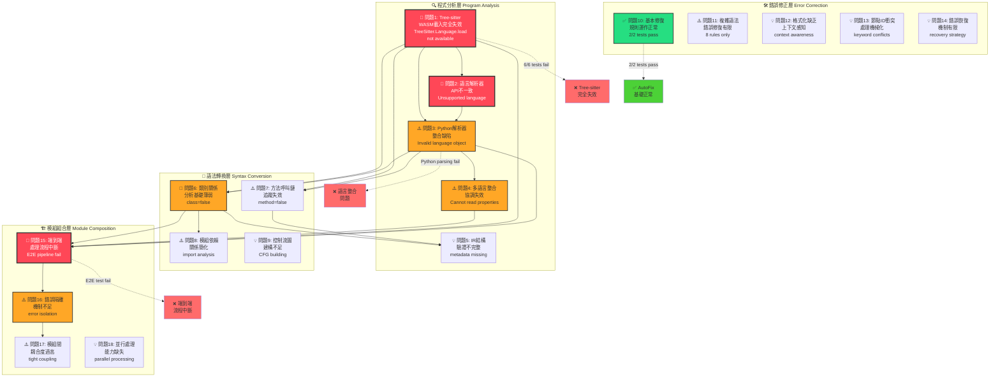
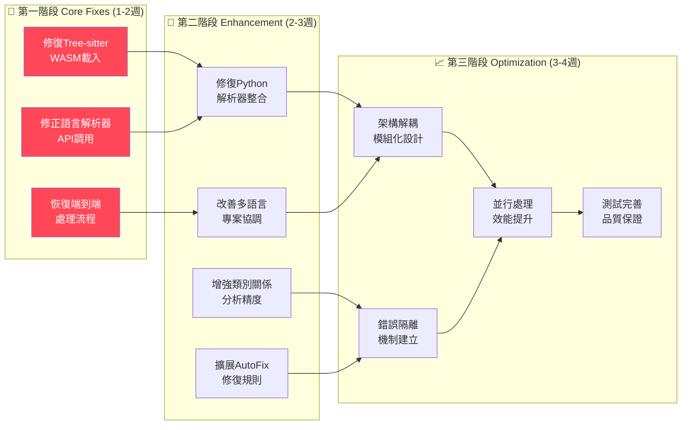
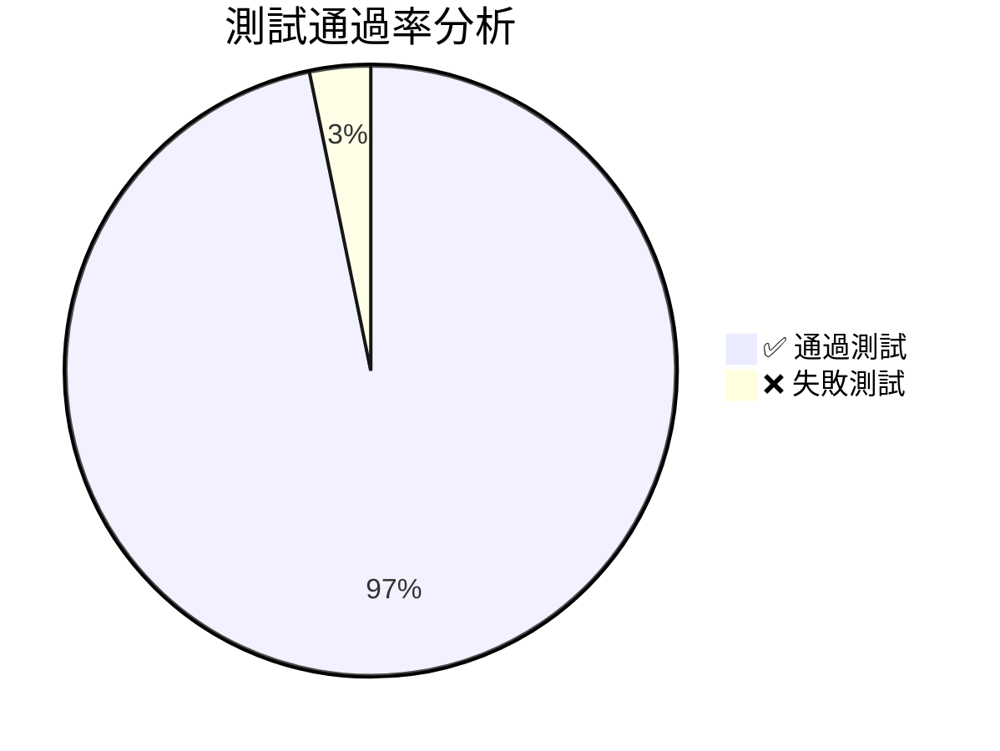
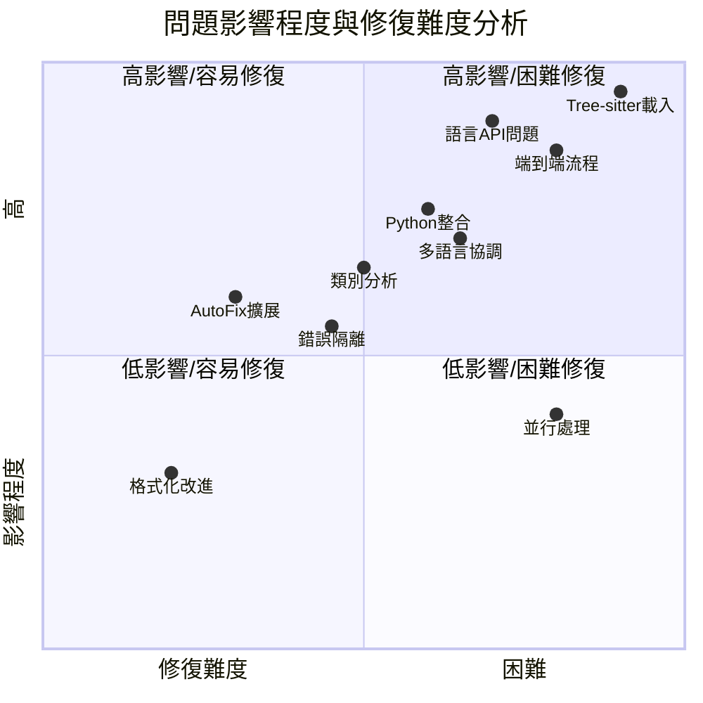

# AutoFix Mermaid 問題流程分析圖

## 問題流向與依賴關係



## 問題解決路徑規劃



## 測試覆蓋現況分析





## 修復進度追蹤

```mermaid
gantt
    title AutoFix Mermaid 問題修復時程
    dateFormat  YYYY-MM-DD
    section 第一階段核心修復
    Tree-sitter WASM修復     :critical, treesitter, 2025-09-24, 7d
    語言API修正              :critical, api-fix, 2025-09-24, 5d
    端到端流程恢復           :critical, e2e-fix, after api-fix, 3d
    
    section 第二階段功能增強  
    Python解析器修復         :important, python-fix, after treesitter, 5d
    多語言整合改善           :important, multilang, after python-fix, 4d
    類別分析增強             :active, class-analysis, after treesitter, 6d
    AutoFix規則擴展         :autofix-expand, after e2e-fix, 7d
    
    section 第三階段系統優化
    架構解耦設計             :arch-decouple, after multilang, 8d
    錯誤隔離機制             :error-isolation, after class-analysis, 6d
    並行處理實作             :parallel, after arch-decouple, 10d
    測試完善                 :testing, after error-isolation, 5d
```

---

**分析完成日期**: 2025年9月24日  
**預估修復週期**: 6-9 週  
**優先修復項目**: Tree-sitter WASM 載入問題  
**成功關鍵**: 恢復端到端處理流程