# AutoFix Mermaid 完整程式架構圖 (Complete System Architecture Diagram) - 2025/09/24 更新版

## 🆕 更新說明 (Update Notes)

**更新日期**: 2025年9月24日  
**版本**: v3.8.1  
**主要變更**: 新增 Problem 8 - Async Processing Pipeline 相關組件

### 📋 新增組件 (New Components)
- **AsyncProcessingPipeline**: 異步處理管線核心
- **PipelineTask**: 任務生命週期管理
- **MermaidProcessingPipeline**: Mermaid 專用管線
- **PipelineFactory**: 管線工廠
- **MemoryManager**: 記憶體管理系統 (Problem 6)
- **ErrorRecoveryManager**: 錯誤恢復系統 (Problem 7)

## 系統架構總覽 (System Architecture Overview)

```mermaid
classDiagram
    %% AutoFix Mermaid 完整程式架構圖 - Complete System Architecture Diagram v3.8.1
    
    %% ============= 使用者介面層 UI Layer =============
    class WebUI {
        -HTMLElement container
        -ConfigPanel configPanel
        -ExportControls exportControls
        +initializeUI() 初始化介面
        +handleFileUpload(files) 處理檔案上傳
        +renderMermaidDiagram(code) 渲染圖表
        +showResults(result) 顯示結果
        +onProgressUpdate(progress) 進度更新
    }
    
    class ConfigPanel {
        -RulePack[] availableRulePacks
        -PromptPack[] availablePromptPacks
        +loadManifest() 載入配置清單
        +selectRulePack(version) 選擇規則包
        +selectPromptPack(version) 選擇提示包
        +getConfiguration() 獲取配置
    }
    
    class ExportControls {
        -string[] supportedFormats
        +exportAsSVG(content) 匯出SVG格式
        +exportAsPNG(content) 匯出PNG格式
        +exportAsMMD(content) 匯出MMD格式
        +exportLogs(logs) 匯出記錄檔
        +batchExport(results[]) 批次匯出
    }
    
    %% ============= 異步處理管線層 Async Pipeline Layer (NEW) =============
    class AsyncProcessingPipeline {
        -TaskQueue taskQueue
        -EventEmitter events
        -ProcessorFunction processor
        -number maxConcurrent
        -number batchSize
        +processItem(data, options) 處理單個項目
        +processBatch(items, options) 批次處理
        +waitForBatch(tasks) 等待批次完成
        +executeTaskLogic(task) 執行任務邏輯
        +onProgress(callback) 進度監聽
        +getDetailedStats() 獲取詳細統計
    }
    
    class PipelineTask {
        -string id
        -Object data
        -TaskStatus status
        -number priority
        -string[] dependencies
        -number retryCount
        -number maxRetries
        +start() 開始任務
        +complete(result) 完成任務
        +fail(error) 任務失敗
        +retry() 重試任務
        +getDuration() 取得執行時間
        +getInfo() 取得任務資訊
    }
    
    class TaskQueue {
        -Map~string,PipelineTask~ tasks
        -Set~string~ runningTasks
        -Set~string~ completedTasks
        -Set~string~ failedTasks
        -number maxConcurrent
        +add(task) 添加任務
        +get(taskId) 取得任務
        +remove(taskId) 移除任務
        +process() 處理佇列
        +getNextTask() 取得下一任務
        +areDependenciesMet(task) 檢查依賴
        +executeTask(task) 執行任務
        +getStats() 取得統計
    }
    
    class MermaidProcessingPipeline {
        -ProcessingStats processingStats
        +processProject(files, options) 處理專案
        +processProjects(projects, options) 批次處理專案
        +processFileList(fileList, options) 處理檔案清單
        +getProcessingStats() 取得處理統計
        +getMemoryStats() 取得記憶體統計
        +setupEventListeners() 設定事件監聽
        +cleanup() 清理資源
    }
    
    class PipelineFactory {
        <<static>>
        +createMermaidPipeline(options) 建立Mermaid管線
        +createCustomPipeline(processor, options) 建立自訂管線
        +createHighPerformancePipeline(processor, options) 建立高效能管線
        +createLowMemoryPipeline(processor, options) 建立低記憶體管線
    }
    
    %% ============= 記憶體管理層 Memory Management Layer (Problem 6) =============
    class MemoryManager {
        -MemoryTracker memoryTracker
        -CacheManager cacheManager
        -ResourceManager resourceManager
        +getStatistics() 取得統計
        +cleanup() 清理記憶體
        +registerResource(id, type, resource) 註冊資源
        +unregisterResource(id) 取消註冊資源
        +getCache(name, options) 取得快取
    }
    
    class MemoryTracker {
        -TrackingStats stats
        -number alertThreshold
        +startMonitoring() 開始監控
        +stopMonitoring() 停止監控
        +getCurrentStats() 取得當前統計
        +getMemoryUsageRatio() 取得記憶體使用比例
    }
    
    class CacheManager {
        -Map~string,InMemoryCache~ caches
        -number totalSize
        +getCache(name, options) 取得快取
        +clearCache(name) 清除快取
        +clearAll() 清除全部
        +getStatistics() 取得統計
    }
    
    %% ============= 錯誤恢復管理層 Error Recovery Layer (Problem 7) =============
    class ErrorRecoveryManager {
        -Map~string,RecoveryStrategy~ strategies
        -RecoveryPolicy policy
        -RecoveryContext context
        +addStrategy(name, strategy) 新增策略
        +recover(error, context) 執行恢復
        +selectStrategy(error, context) 選擇策略
        +updatePolicy(policy) 更新策略
        +getRecoveryHistory() 取得恢復歷史
    }
    
    class RecoveryStrategy {
        <<abstract>>
        -string name
        -number priority
        +canHandle(error, context) 檢查是否可處理
        +recover(error, context) 執行恢復
        +getEstimatedTime() 估計時間
        +cleanup() 清理
    }
    
    class FallbackStrategy {
        -FallbackConfig config
        +canHandle(error, context) 檢查是否可處理
        +recover(error, context) 執行恢復
        +provideFallback(context) 提供備案
    }
    
    class RetryStrategy {
        -RetryConfig config
        +canHandle(error, context) 檢查是否可處理
        +recover(error, context) 執行恢復
        +shouldRetry(attempt, error) 是否重試
    }
    
    %% ============= 工作管線層 Pipeline Layer =============
    class WorkerManager {
        -Worker[] workers
        -AsyncProcessingPipeline pipeline
        +createWorker(type) 建立工作執行緒
        +executeTask(task) 執行任務
        +getResult(taskId) 獲取結果
        +terminateWorker(workerId) 終止工作執行緒
    }
    
    class PipelineOrchestrator {
        -PipelineStage[] stages
        -ErrorRecoveryManager errorHandler
        -MermaidProcessingPipeline pipeline
        +runPipeline(input, options) 執行管線
        +executeStage(stage, data) 執行階段
        +handleStageError(error, stage) 處理階段錯誤
        +aggregateResults(results[]) 彙總結果
    }
    
    %% ============= 程式分析層 Analysis Layer =============
    class LanguageDetector {
        -DetectionRule[] rules
        +detectLanguage(files) 偵測語言
        +getConfidence(language, content) 獲取信心度
        +getSupportedLanguages() 獲取支援語言
    }
    
    class TreeSitterLoader {
        -Map parsers
        -WASMModule[] loadedModules
        +initialize() 初始化
        +loadLanguage(language) 載入語言
        +createParser(language) 建立解析器
        +isSupported(language) 檢查支援性
    }
    
    class MultiAnalyzer {
        -Map~string,Analyzer~ analyzers
        -ParserCoordinator coordinator
        +analyzeProject(files, options) 分析專案
        +selectAnalyzer(language) 選擇分析器
        +coordinateAnalysis(files) 協調分析
        +mergeResults(results[]) 合併結果
    }
    
    class JavaScriptAnalyzer {
        -TreeSitterParser parser
        -RegexFallbackParser fallbackParser
        +analyzeProject(files, options) 分析專案
        +parseFile(filePath, content) 解析檔案
        +extractEntities(ast) 擷取實體
        +analyzeRelations(ir) 分析關聯
    }
    
    class PythonAnalyzer {
        -ASTParser parser
        +analyzeProject(files, options) 分析專案
        +parseModule(content) 解析模組
        +extractClasses(ast) 擷取類別
        +extractFunctions(ast) 擷取函數
    }
    
    %% ============= 中間表示層 IR Layer =============
    class IRManager {
        -IRProject currentProject
        -IRValidator validator
        +createIR(meta) 建立IR
        +addEntity(entity) 新增實體
        +addRelation(relation) 新增關聯
        +findEntity(id) 查找實體
        +validateIR(ir) 驗證IR
    }
    
    class UnifiedIR {
        -IRProject project
        -Map~string,Entity~ entityIndex
        -Map~string,Relation~ relationIndex
        +normalize(rawIR) 正規化IR
        +merge(otherIR) 合併IR
        +query(selector) 查詢IR
        +transform(transformer) 轉換IR
    }
    
    class IRProject {
        -IRMeta meta
        -Entity[] entities
        -Relation[] relations
        -CallGraph callGraph
        -DependencyGraph dependencyGraph
        +getModules() �取模組
        +getClasses() 獲取類別
        +getFunctions() 獲取函數
        +getStatistics() 獲取統計
    }
    
    %% ============= 規則優化層 Rule Optimization Layer (Problem 5) =============
    class RuleOptimizationCoordinator {
        -Map~string,RuleSet~ ruleSets
        -OptimizationPolicy policy
        -PerformanceMonitor monitor
        +initialize(ruleSets) 初始化
        +processWithRules(text, diagramType, options) 處理規則
        +batchProcess(diagrams, options) 批次處理
        +optimizePerformance(config) 最佳化效能
        +getStatistics() 取得統計
        +cleanup() 清理
    }
    
    class RuleCache {
        -Map~string,CachedRule~ cache
        -CacheStats stats
        +get(key) 取得快取規則
        +set(key, rule) 設定快取規則
        +invalidate(pattern) 失效快取
        +getHitRate() 取得命中率
    }
    
    %% ============= 錯誤傳播層 Error Propagation Layer (Problem 3) =============
    class ErrorPropagationManager {
        -Map~string,ErrorContext~ activeContexts
        -ErrorContext[] errorHistory
        -Map~string,Handler[]~ handlers
        -EventListener[] listeners
        +createContext(options) 建立上下文
        +propagateError(error, options) 傳播錯誤
        +chainError(newError, parentError) 建立錯誤鏈
        +registerHandler(errorCode, handler) 註冊處理器
        +addListener(eventType, listener) 添加監聽器
        +getStatistics() 取得統計
    }
    
    class ErrorContext {
        -string id
        -string timestamp
        -string message
        -ErrorSource source
        -ErrorContextData context
        -ErrorRecovery recovery
        +chainWith(parentError) 鏈結父錯誤
        +addRecoveryAttempt(attempt) 添加恢復嘗試
        +getErrorChain() 取得錯誤鏈
        +getSeverity() 取得嚴重程度
    }
    
    %% ============= 圖表生成層 Emitter Layer =============
    class DiagramEmitter {
        -EmitterStrategy[] strategies
        +generateDiagram(ir, type, options) 生成圖表
        +selectStrategy(type) 選擇策略
        +applyLayout(diagram) 套用佈局
    }
    
    class MermaidEmitter {
        -EmitterConfig config
        +emitFlowchart(ir) 生成流程圖
        +emitClassDiagram(ir) 生成類別圖
        +emitSequenceDiagram(ir) 生成時序圖
        +emitCallGraph(ir) 生成呼叫圖
        +emitDependencyGraph(ir) 生成依賴圖
    }
    
    %% ============= 規則引擎層 Rules Engine Layer =============
    class RulesEngine {
        -RulePack[] loadedRules
        -RuleValidator validator
        +loadRulePack(manifest) 載入規則包
        +validateRules(rules) 驗證規則
        +applyRules(diagram, context) 套用規則
        +getApplicableRules(context) 獲取適用規則
    }
    
    %% ============= 關係定義 Relationships =============
    
    %% UI Layer relationships
    WebUI --> ConfigPanel : uses
    WebUI --> ExportControls : uses
    WebUI --> MermaidProcessingPipeline : uses
    
    %% Async Pipeline Layer relationships (NEW)
    AsyncProcessingPipeline --> TaskQueue : contains
    AsyncProcessingPipeline --> PipelineTask : manages
    TaskQueue --> PipelineTask : stores
    MermaidProcessingPipeline --|> AsyncProcessingPipeline : extends
    PipelineFactory --> MermaidProcessingPipeline : creates
    PipelineFactory --> AsyncProcessingPipeline : creates
    
    %% Memory Management relationships (Problem 6)
    MemoryManager --> MemoryTracker : contains
    MemoryManager --> CacheManager : contains
    MermaidProcessingPipeline --> MemoryManager : uses
    
    %% Error Recovery relationships (Problem 7)
    ErrorRecoveryManager --> RecoveryStrategy : manages
    RecoveryStrategy <|-- FallbackStrategy : implements
    RecoveryStrategy <|-- RetryStrategy : implements
    MermaidProcessingPipeline --> ErrorRecoveryManager : uses
    
    %% Pipeline Layer relationships
    WorkerManager --> AsyncProcessingPipeline : uses
    PipelineOrchestrator --> ErrorRecoveryManager : uses
    PipelineOrchestrator --> MermaidProcessingPipeline : uses
    
    %% Analysis Layer relationships
    MultiAnalyzer --> JavaScriptAnalyzer : contains
    MultiAnalyzer --> PythonAnalyzer : contains
    MultiAnalyzer --> TreeSitterLoader : uses
    
    %% IR Layer relationships
    IRManager --> UnifiedIR : uses
    IRManager --> IRProject : manages
    
    %% Rule Optimization relationships (Problem 5)
    RuleOptimizationCoordinator --> RuleCache : uses
    MermaidProcessingPipeline --> RuleOptimizationCoordinator : uses
    
    %% Error Propagation relationships (Problem 3)
    ErrorPropagationManager --> ErrorContext : manages
    MermaidProcessingPipeline --> ErrorPropagationManager : uses
    ErrorRecoveryManager --> ErrorPropagationManager : uses
    
    %% Emitter Layer relationships
    DiagramEmitter --> MermaidEmitter : contains
    MermaidProcessingPipeline --> DiagramEmitter : uses
    
    %% Rules Engine relationships
    RulesEngine --> RuleOptimizationCoordinator : uses
```

## 🔧 架構層級說明 (Architecture Layers)

### 🎨 **使用者介面層 (UI Layer)**
- **WebUI**: 主要網頁介面，新增進度更新功能
- **ConfigPanel**: 配置面板，管理規則包和提示包選擇
- **ExportControls**: 匯出控制，支援多種格式輸出和批次匯出

### ⚡ **異步處理管線層 (Async Pipeline Layer) - NEW**
- **AsyncProcessingPipeline**: 異步處理管線核心，支援並行處理和批次操作
- **PipelineTask**: 任務生命週期管理，包含重試機制和依賴管理
- **TaskQueue**: 智能任務佇列，支援優先級和並行控制
- **MermaidProcessingPipeline**: 專為 Mermaid 圖表生成優化的管線
- **PipelineFactory**: 管線工廠，提供多種預設配置

### 💾 **記憶體管理層 (Memory Management Layer) - Problem 6**
- **MemoryManager**: 統一記憶體管理，整合追蹤、快取和資源管理
- **MemoryTracker**: 實時記憶體監控和警示
- **CacheManager**: 智能快取管理和生命週期控制

### 🛡️ **錯誤恢復管理層 (Error Recovery Layer) - Problem 7**
- **ErrorRecoveryManager**: 智能錯誤恢復協調器
- **RecoveryStrategy**: 恢復策略抽象基類
- **FallbackStrategy**: 備案恢復策略
- **RetryStrategy**: 重試恢復策略

### ⚙️ **工作管線層 (Pipeline Layer) - UPDATED**
- **WorkerManager**: Worker 管理器，整合異步管線
- **PipelineOrchestrator**: 管線協調器，整合錯誤恢復

### 🔍 **程式分析層 (Analysis Layer) - ENHANCED**
- **MultiAnalyzer**: 多語言分析器協調器
- **JavaScriptAnalyzer**: JavaScript 專用分析器
- **PythonAnalyzer**: Python 專用分析器
- **TreeSitterLoader**: Tree-sitter WASM 載入器

### 📊 **中間表示層 (IR Layer) - ENHANCED**
- **IRManager**: IR 管理器，整合驗證功能
- **UnifiedIR**: 統一 IR 介面，支援查詢和轉換
- **IRProject**: IR 專案容器，新增依賴圖支援

### 🎯 **規則優化層 (Rule Optimization Layer) - Problem 5**
- **RuleOptimizationCoordinator**: 規則最佳化協調器
- **RuleCache**: 高效能規則快取系統

### 🔗 **錯誤傳播層 (Error Propagation Layer) - Problem 3**
- **ErrorPropagationManager**: 錯誤傳播管理器
- **ErrorContext**: 完整的錯誤上下文資料結構

### 🎨 **圖表生成層 (Emitter Layer)**
- **DiagramEmitter**: 圖表生成器
- **MermaidEmitter**: Mermaid 格式專用生成器

### 📋 **規則引擎層 (Rules Engine Layer)**
- **RulesEngine**: 規則引擎核心

## 📈 問題解決進度 (Problem Resolution Progress)

| 問題 | 狀態 | 實作組件 |
|------|------|----------|
| Problem 1 | ✅ | TreeSitterLoader, WASMOptimizer |
| Problem 2 | ✅ | UnifiedIR, IRValidator |
| Problem 3 | ✅ | ErrorPropagationManager, ErrorContext |
| Problem 4 | ✅ | MultiAnalyzer, ParserCoordinator |
| Problem 5 | ✅ | RuleOptimizationCoordinator, RuleCache |
| Problem 6 | ✅ | MemoryManager, MemoryTracker, CacheManager |
| Problem 7 | ✅ | ErrorRecoveryManager, RecoveryStrategy |
| **Problem 8** | ✅ | **AsyncProcessingPipeline, MermaidProcessingPipeline** |
| Problem 9 | ⏳ | - |
| Problem 10 | ⏳ | - |
| Problem 11 | ⏳ | - |

## 🔄 主要變更摘要 (Major Changes Summary)

### 🆕 新增功能
1. **異步處理管線系統** - 完整的任務管理和並行處理
2. **記憶體管理系統** - 智能記憶體監控和快取管理
3. **錯誤恢復系統** - 多策略智能錯誤恢復

### 🔧 架構改進
1. **管線協調器** - 整合錯誤恢復和異步處理
2. **多語言分析器** - 統一的分析器協調
3. **統一 IR** - 增強的 IR 查詢和轉換能力

### 📊 效能優化
1. **規則快取系統** - 大幅提升規則處理效能
2. **批次處理** - 支援大量檔案的並行處理
3. **記憶體優化** - 防止記憶體洩漏和自動清理

## 🎯 下一階段目標 (Next Phase Goals)

- **Problem 9**: Error recovery mechanisms (延續 Problem 7)
- **Problem 10**: Performance monitoring integration
- **Problem 11**: Documentation and API consistency

---

**版本**: v3.8.1  
**更新日期**: 2025年9月24日  
**維護者**: AutoFix Mermaid Team