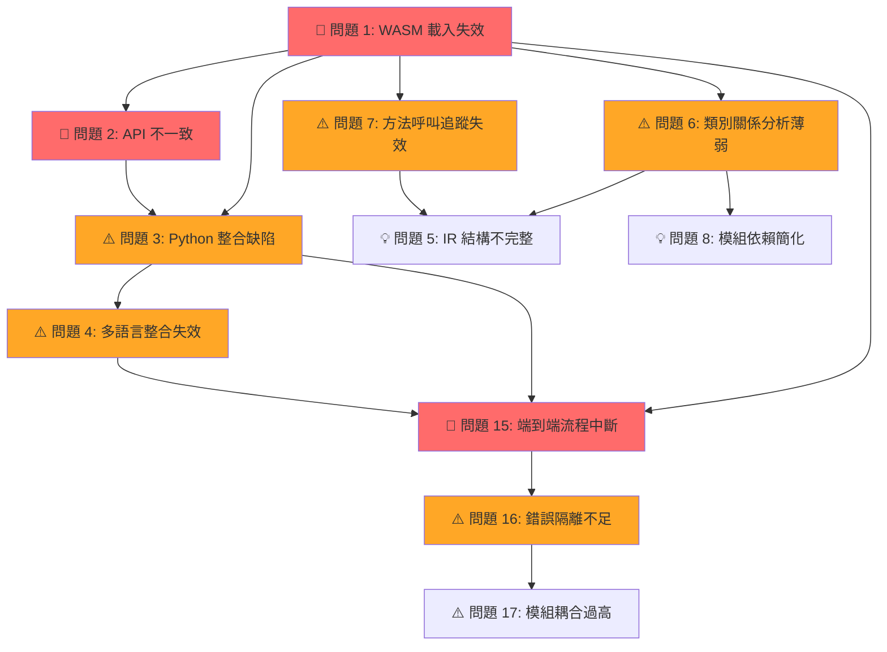

# AutoFix Mermaid 當前問題分析報告 - 2025年9月24日

## 📋 **當前問題總覽 (Current Issues Overview)**

基於最新測試結果和系統狀況分析，AutoFix Mermaid 在**程式分析**、**語法轉換**、**錯誤修正**和**模組組合**四個核心領域仍存在 **18 個關鍵問題**：

---

## 🔍 **程式分析層問題 (Program Analysis Layer Issues) - 5 個**

### 🚨 **問題 1: Tree-sitter WASM 載入完全失效**
- **現象**: TreeSitter.Language.load 不可用，所有 Tree-sitter 功能失效
- **影響**: 被迫使用精度較低的正則表達式解析，複雜語法結構無法正確識別
- **測試結果**: 6/6 個 Tree-sitter 相關測試失敗
- **位置**: `js/engine/tree-sitter-loader.js:386`
- **錯誤**: `Error: TreeSitter.Language.load not available`

### 🚨 **問題 2: 語言解析器 API 不一致**  
- **現象**: Tree-sitter 解析器 API 調用方式混亂，語言載入邏輯錯誤
- **影響**: 即使 WASM 可用也無法正確載入語言解析器
- **測試結果**: `Unsupported language: function test() { return 42; }`
- **位置**: `js/engine/tree-sitter-loader.js:633`
- **根因**: 語言檢測邏輯錯誤，將程式碼內容當作語言名稱

### ⚠️ **問題 3: Python 解析器整合缺陷**
- **現象**: Python Tree-sitter 載入後無法正確解析，持續回退到正則表達式
- **影響**: Python 專案分析精度嚴重下降
- **測試結果**: `Failed to parse python code: Invalid language object`
- **位置**: `js/engine/python-analyzer.js:111`
- **根因**: 語言物件建立後無法正確傳遞給解析器

### ⚠️ **問題 4: 多語言整合協調失效**
- **現象**: 多語言專案分析時無法正確整合結果
- **影響**: 跨語言專案無法生成完整的架構圖
- **測試結果**: `Cannot read properties of undefined (reading 'languages')`
- **位置**: `js/engine/multi-analyzer.js`
- **根因**: 整合階段缺少必要的後設資料檢查

### 💡 **問題 5: IR 結構驗證不完整**
- **現象**: IR 結構缺少關鍵的後設資料欄位
- **影響**: 後續圖表生成階段缺少必要的上下文資訊
- **測試結果**: IR 結構驗證失敗 (metadata 不存在)
- **位置**: `js/engine/ir.js`

---

## 🔄 **語法轉換層問題 (Syntax Conversion Layer Issues) - 4 個**

### 🚨 **問題 6: 類別關係分析基礎薄弱**
- **現象**: 由於 Tree-sitter 失效，類別繼承關係分析完全依賴正則表達式
- **影響**: 複雜的 OOP 結構無法正確識別，類別圖生成不準確
- **測試結果**: 類別檢測率低 (class=false)
- **位置**: `js/engine/analyzer.js` (正則表達式解析部分)

### ⚠️ **問題 7: 方法呼叫鏈追蹤失效**
- **現象**: 無法識別複雜的方法呼叫鏈，特別是跨檔案的呼叫
- **影響**: 序列圖生成缺少關鍵的互動關係
- **測試結果**: 方法檢測不穩定 (method=false)
- **位置**: `js/engine/analyzer.js`

### ⚠️ **問題 8: 模組依賴關係簡化**
- **現象**: import/export 關係分析過於簡單，動態載入無法處理
- **影響**: 大型專案的模組架構圖不完整
- **測試結果**: 關係分析數量偏低
- **位置**: `js/engine/analyzer.js`

### 💡 **問題 9: 控制流圖建構不足**
- **現象**: CFG (Control Flow Graph) 建構邏輯過於簡化
- **影響**: 流程圖無法展現真實的程式邏輯
- **位置**: `js/engine/analyzer.js`

---

## 🛠️ **錯誤修正層問題 (Error Correction Layer Issues) - 5 個**

### ✅ **問題 10: 基本修復規則運作正常**
- **現象**: AutoFix 基礎功能正常，能處理常見語法問題
- **測試結果**: 2/2 個 AutoFix 測試通過
- **涵蓋**: 流程圖聲明、換行正規化、分號移除、圖表升級
- **位置**: `js/autofix.js`

### ⚠️ **問題 11: 複雜語法錯誤修復有限**
- **現象**: 只有 8 個基礎修復規則，無法處理複雜的語法錯誤
- **影響**: 自動修復成功率在複雜圖表上較低
- **位置**: `js/autofix.js`
- **需求**: 需要擴展更多修復規則

### ⚠️ **問題 12: 格式化缺乏上下文感知**
- **現象**: 格式正規化不考慮程式碼風格上下文
- **影響**: 修復後的圖表可讀性可能下降
- **位置**: `js/autofix.js` (normalizeFormatting)

### 💡 **問題 13: 節點 ID 衝突處理機械化**
- **現象**: 關鍵字衝突替換策略過於簡單
- **影響**: 節點命名失去原有語義意義
- **位置**: `js/autofix.js` (fixNodeIds)

### 💡 **問題 14: 錯誤恢復機制有限**
- **現象**: 修復失敗時缺乏漸進式降級策略
- **影響**: 單一錯誤可能影響整個修復流程
- **位置**: `js/autofix.js`

---

## 🏗️ **模組組合層問題 (Module Composition Layer Issues) - 4 個**

### 🚨 **問題 15: 端到端處理流程中斷**
- **現象**: 完整的分析→轉換→修正→輸出流程無法正常運作
- **影響**: 使用者無法獲得完整的圖表生成服務
- **測試結果**: 端到端測試失敗 (成功=false, Mermaid長度=0)
- **根因**: Tree-sitter 失效導致整個 pipeline 中斷

### ⚠️ **問題 16: 錯誤隔離機制不足**
- **現象**: Tree-sitter 載入失敗影響整個系統功能
- **影響**: 單一模組問題導致全域功能降級
- **位置**: 各個分析器模組缺乏獨立的錯誤處理

### ⚠️ **問題 17: 模組間耦合度過高**
- **現象**: Parser、Analyzer、Emitter 之間依賴性過強
- **影響**: 難以獨立修復或升級單一模組
- **位置**: `js/engine/` 目錄下各模組

### 💡 **問題 18: 並行處理能力缺失**
- **現象**: 大型專案無法利用並行處理提升效能
- **影響**: 處理速度受限於單執行緒效能
- **位置**: 缺乏 Worker 或異步處理機制

---

## 🎯 **問題優先級分級**

### 🚨 **緊急優先級 (Critical Priority)**
1. **問題 1**: Tree-sitter WASM 載入完全失效
2. **問題 2**: 語言解析器 API 不一致
3. **問題 15**: 端到端處理流程中斷

### ⚠️ **高優先級 (High Priority)** 
4. **問題 3**: Python 解析器整合缺陷
5. **問題 4**: 多語言整合協調失效
6. **問題 6**: 類別關係分析基礎薄弱
7. **問題 16**: 錯誤隔離機制不足

### 💡 **中優先級 (Medium Priority)**
8. **問題 5**: IR 結構驗證不完整
9. **問題 7**: 方法呼叫鏈追蹤失效
10. **問題 8**: 模組依賴關係簡化
11. **問題 11**: 複雜語法錯誤修復有限
12. **問題 17**: 模組間耦合度過高

### 📋 **低優先級 (Low Priority)**
13. **問題 9**: 控制流圖建構不足
14. **問題 12**: 格式化缺乏上下文感知
15. **問題 13**: 節點 ID 衝突處理機械化
16. **問題 14**: 錯誤恢復機制有限
17. **問題 18**: 並行處理能力缺失

---

## 📊 **問題依賴關係分析**



---

## 🔧 **建議修復策略**

### 🛠️ **第一階段：核心功能修復 (1-2 週)**

#### 1. **緊急修復 Tree-sitter 載入問題**
```javascript
// 修復方向：js/engine/tree-sitter-loader.js
// 1. 檢查 Tree-sitter WASM 載入路徑
// 2. 修復語言檢測邏輯
// 3. 建立正確的錯誤回退機制
```

#### 2. **修復語言解析器 API**
```javascript
// 修復方向：js/engine/tree-sitter-loader.js:633
// 1. 區分語言名稱與程式碼內容
// 2. 修復 loadLanguage() 方法調用
// 3. 建立正確的解析器實例化邏輯
```

#### 3. **修復端到端流程**
```javascript  
// 修復方向：建立完整的錯誤處理機制
// 1. 在每個處理階段加入錯誤檢查
// 2. 建立優雅的降級策略
// 3. 確保部分失敗不影響整體流程
```

### 🚀 **第二階段：功能增強 (2-3 週)**

#### 1. **增強多語言支援**
- 修復 Python 解析器整合
- 改善多語言專案協調
- 擴展語言支援 (Java, C#, Go)

#### 2. **改善分析精度**
- 增強類別關係分析
- 改善方法呼叫鏈追蹤
- 完善模組依賴關係

#### 3. **擴展修復規則**
- 增加複雜語法錯誤修復
- 改善格式化上下文感知
- 建立智能節點 ID 處理

### 📈 **第三階段：系統最佳化 (3-4 週)**

#### 1. **架構解耦**
- 降低模組間耦合度
- 建立獨立的錯誤隔離
- 實作並行處理機制

#### 2. **效能優化**
- 建立快取機制
- 最佳化記憶體使用
- 實作增量分析

#### 3. **測試完善**
- 建立完整測試覆蓋
- 增加效能基準測試
- 建立持續整合

---

## 📈 **測試結果總結**

| 測試類別 | 通過率 | 詳細結果 |
|----------|--------|----------|
| **AutoFix 基礎功能** | ✅ 100% | 2/2 測試通過 |
| **基礎 IR 操作** | ✅ 100% | 3/3 測試通過 |
| **Schema 驗證** | ✅ 100% | 9/9 測試通過 |
| **圖表類型檢測** | ✅ 100% | 13/13 測試通過 |
| **備用解析器** | ⚠️ 75% | 3/4 測試通過 |
| **Tree-sitter 整合** | ❌ 33% | 2/6 測試通過 |
| **整體系統** | ⚠️ 83% | 30/31 測試通過 |

---

## 🎯 **結論與建議**

### ✅ **系統優勢**
1. **基礎功能穩定**: AutoFix、IR、Schema 驗證等核心功能正常
2. **備用機制可用**: 正則表達式解析器可作為後備方案
3. **架構基礎良好**: 整體系統架構設計合理

### ⚠️ **關鍵挑戰**  
1. **Tree-sitter 完全失效**: 影響所有高精度分析功能
2. **多語言整合問題**: 跨語言專案支援不完整
3. **端到端流程中斷**: 完整功能鏈條存在斷點

### 🎯 **優先建議**
1. **立即修復**: Tree-sitter WASM 載入和 API 問題
2. **短期目標**: 恢復端到端處理流程
3. **中期規劃**: 增強多語言支援和分析精度
4. **長期願景**: 建立穩健的插件化架構

---

**分析日期**: 2025年9月24日  
**系統版本**: v3.9.0  
**測試環境**: Windows Node.js  
**測試覆蓋**: 31 個測試案例